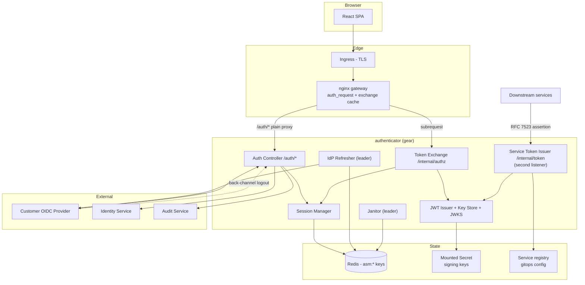
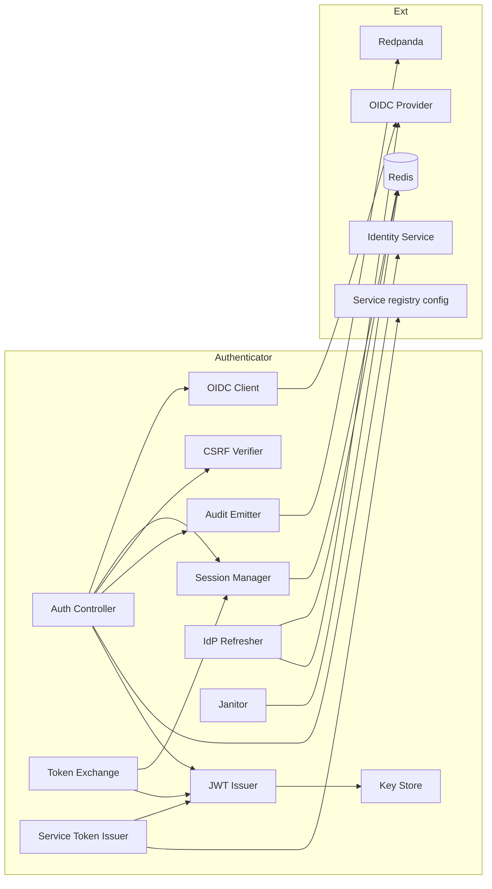
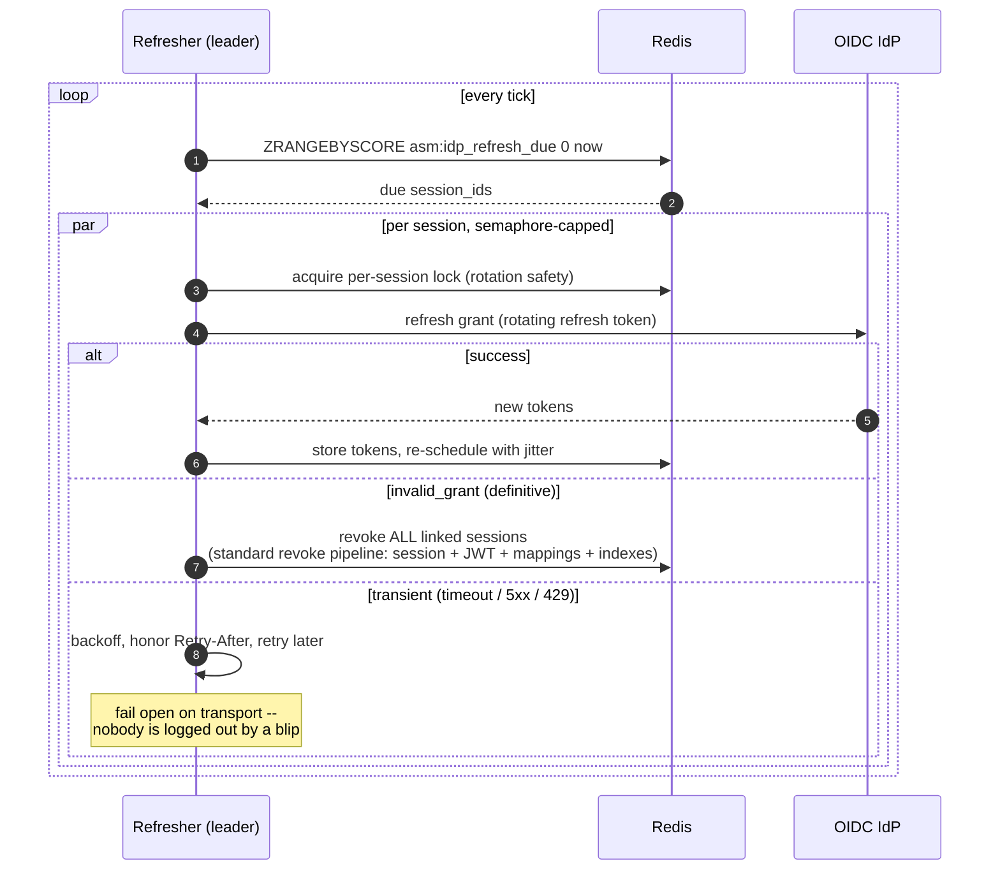
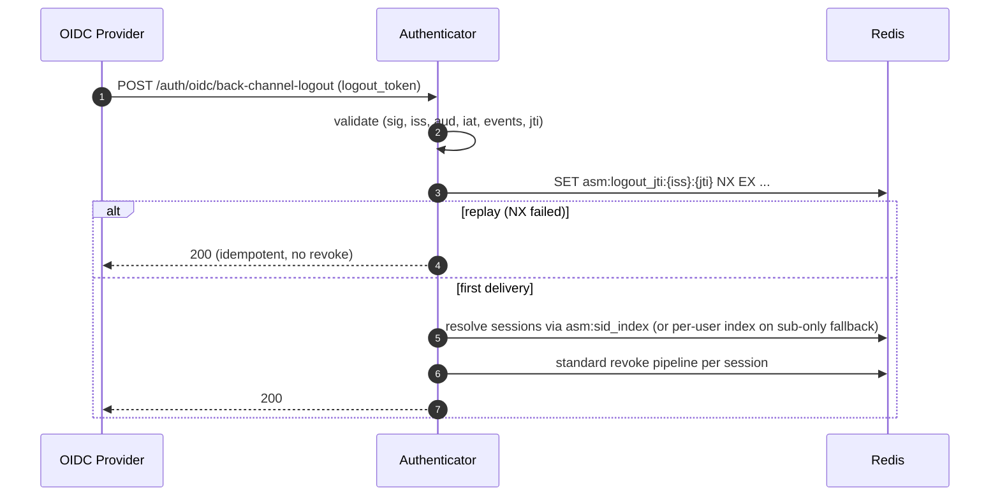
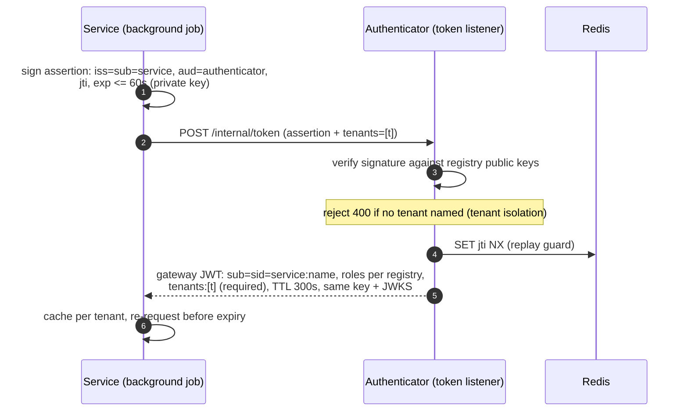
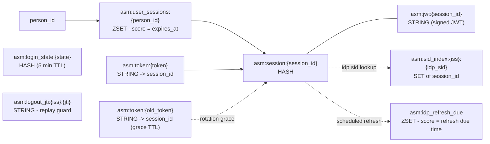

# DESIGN -- Authenticator Service

- [ ] `p3` - **ID**: `cpt-insightspec-design-auth`

<!-- toc -->

- [1. Architecture Overview](#1-architecture-overview)
  - [1.1 Architectural Vision](#11-architectural-vision)
  - [1.2 Architecture Drivers](#12-architecture-drivers)
  - [1.3 Architecture Layers](#13-architecture-layers)
- [2. Principles & Constraints](#2-principles--constraints)
  - [2.1 Design Principles](#21-design-principles)
  - [2.2 Constraints](#22-constraints)
- [3. Technical Architecture](#3-technical-architecture)
  - [3.1 Domain Model](#31-domain-model)
  - [3.2 Component Model](#32-component-model)
  - [3.3 API Contracts](#33-api-contracts)
  - [3.4 Internal Dependencies](#34-internal-dependencies)
  - [3.5 External Dependencies](#35-external-dependencies)
  - [3.6 Interactions & Sequences](#36-interactions--sequences)
  - [3.7 Database schemas & tables](#37-database-schemas--tables)
  - [3.8 Gateway JWT Claim Contract](#38-gateway-jwt-claim-contract)
  - [3.9 Configuration Surface](#39-configuration-surface)
  - [3.10 Gear Anatomy](#310-gear-anatomy)
- [4. Cross-Cutting Concerns](#4-cross-cutting-concerns)
  - [4.1 Cookie Hardening](#41-cookie-hardening)
  - [4.2 CSRF Defense](#42-csrf-defense)
  - [4.3 Janitor and Leader Election](#43-janitor-and-leader-election)
  - [4.4 Rate Limiting](#44-rate-limiting)
  - [4.5 Key Rotation](#45-key-rotation)
  - [4.6 Bootstrap Guardrails](#46-bootstrap-guardrails)
  - [4.7 Observability](#47-observability)
- [5. Design Decisions](#5-design-decisions)
  - [Carried over from the deleted API Gateway specs](#carried-over-from-the-deleted-api-gateway-specs)
  - [Superseded decisions](#superseded-decisions)
  - [DD-AUTH-01: JWT Minted at Login, Linked 1:1 to the Session](#dd-auth-01-jwt-minted-at-login-linked-11-to-the-session)
  - [DD-AUTH-02: Session Identity / Credential Split](#dd-auth-02-session-identity--credential-split)
  - [DD-AUTH-03: Background IdP Token Refresh](#dd-auth-03-background-idp-token-refresh)
  - [DD-AUTH-04: Tenants and Roles in the JWT](#dd-auth-04-tenants-and-roles-in-the-jwt)
  - [DD-AUTH-05: Service Tokens via RFC 7523 Assertions and a Public-Key Registry](#dd-auth-05-service-tokens-via-rfc-7523-assertions-and-a-public-key-registry)
  - [DD-AUTH-06: Two Listeners for Two Internal Surfaces](#dd-auth-06-two-listeners-for-two-internal-surfaces)
  - [DD-AUTH-07: Access-Control Claims Fetched Once, at Login](#dd-auth-07-access-control-claims-fetched-once-at-login)
  - [DD-AUTH-08: Empty-Table First-Admin Bootstrap plus INSTALLER](#dd-auth-08-empty-table-first-admin-bootstrap-plus-installer)
  - [RESOLVED (step 04): ES256 for the Gateway JWT](#resolved-step-04-es256-for-the-gateway-jwt)
- [6. Traceability](#6-traceability)

<!-- /toc -->

---

## 1. Architecture Overview

### 1.1 Architectural Vision

The authenticator is the BFF half of the deleted API Gateway spec, kept as a standalone service, minus proxying, plus the two things the deleted Router owned that are auth (not proxy) work: the cookie-to-JWT exchange and JWKS publication. nginx (see [Gateway DESIGN](../gateway/DESIGN.md)) does the routing; the authenticator answers its `auth_request` subrequests.

Three deliberate changes against the old BFF spec shape the design. First, the gateway JWT is **born at login together with the session** and stored linked 1:1 to it -- not minted lazily per request; the hot path serves a stored token and reissues it ahead of expiry. Second, the session's **identity is split from its credential**: a stable `session_id` (UUIDv7) keys everything server-side, while the cookie value is a rotating mapping to it -- rotation is one write plus one expiring key. Third, **IdP tokens are refreshed in the background**, so a session can never outlive the IdP's willingness to vouch for the user.

The authenticator is a plain HTTP service: no proxying, no K8s API access, no streaming -- deliberately small and testable, because it is the security-critical core. It is an idiomatic gears-rust toolkit gear (see 3.10), stateless across pods, with all state in Redis and background workers behind a Redis leader lock. The `auth_request` pattern (Envoy `ext_authz`, Traefik `forwardAuth` are the same contract) keeps it edge-agnostic: if nginx is ever replaced, the authenticator survives untouched.

### 1.2 Architecture Drivers

#### Functional Drivers

| Requirement | Design Response |
|---|---|
| `cpt-insightspec-fr-auth-oidc-login` | Confidential OIDC client with PKCE; IdP tokens stored in the session record only; session-fixation revoke on callback |
| `cpt-insightspec-fr-auth-session-model` | Stable `session_id` (UUIDv7) keys everything; `asm:token:{token}` mapping is the only rotating artifact |
| `cpt-insightspec-fr-auth-session-cookie` | `__Host-`-prefixed opaque cookie, TTL 600 s default, set on `/auth/callback` |
| `cpt-insightspec-fr-auth-session-refresh` | New mapping write + old-mapping grace TTL; `refresh_at` with 90 s margin and 120 s jitter window |
| `cpt-insightspec-fr-auth-session-store` | Redis keyspace in 3.7: session HASH, token mapping, linked JWT, ZSET index, sid index, refresh-due ZSET; MULTI/EXEC pipelines |
| `cpt-insightspec-fr-auth-linked-jwt` | JWT Issuer mints at login; exchange serves stored JWT; reissue-ahead with `SET NX EX` (stampede-safe) |
| `cpt-insightspec-fr-auth-authz-exchange` | `GET /internal/authz`: two Redis reads on the hot path; `Cache-Control` computed per response |
| `cpt-insightspec-fr-auth-jwks` | Key Store over a mounted secret; static JWKS handler |
| `cpt-insightspec-fr-auth-session-list`, `cpt-insightspec-fr-auth-session-revoke` | ZSET index reads; one revoke pipeline shared by logout, back-channel, admin, and `invalid_grant` paths |
| `cpt-insightspec-fr-auth-logout` | Local + RP-initiated + back-channel receiver with `jti` replay guard |
| `cpt-insightspec-fr-auth-csrf` | Double-submit token bound to the session + `Origin` allowlist |
| `cpt-insightspec-fr-auth-idp-refresh` | Leader-elected refresher over `asm:idp_refresh_due`; per-session rotation lock; fail-open transport / fail-closed verdict |
| `cpt-insightspec-fr-auth-service-tokens` | Token listener + RFC 7523 verification against the registry; same signer, same JWKS |
| `cpt-insightspec-fr-auth-bootstrap` | Empty-table guard in the login path; INSTALLER as the production path |
| `cpt-insightspec-fr-auth-internal-reachability` | Two listeners (3.10); NetworkPolicies; credential checks on every endpoint |

#### NFR Allocation

| NFR ID | NFR Summary | Allocated To | Design Response | Verification Approach |
|--------|-------------|--------------|-----------------|----------------------|
| `cpt-insightspec-nfr-auth-exchange-p95` | Exchange within 5 ms p95 | Token Exchange | Two pipelined Redis reads; no IdP, no DB on the hot path | Load test, p95 at `/internal/authz` |
| `cpt-insightspec-nfr-auth-session-ttl` | TTL knobs via Helm | Config struct | All values in 3.9 deserialize from the gear config section | Integration test with overridden values |
| `cpt-insightspec-nfr-auth-cookie-attrs` | Hardened cookie attributes | Auth Controller | Single cookie helper; attributes hard-coded | Snapshot test on `Set-Cookie` |
| `cpt-insightspec-nfr-auth-audit` | 100% auth-event audit | Audit Emitter | One emitter called from every state change | Integration test per auth action |
| `cpt-insightspec-nfr-auth-rate-limit` | Layer-2 precise limits | Auth Controller | Redis token bucket by session/user + login-state cap | Flood test: 429 at cap, bounded Redis entries |
| `cpt-insightspec-nfr-auth-fail-closed` | No auth without Redis | Session Manager | No local cache; readiness = Redis + keys loaded | Kill Redis; verify 401/503 + not-ready |

**ADRs**: to be authored alongside implementation; decisions captured inline in [section 5](#5-design-decisions) until then, including the carried-over and superseded decisions from the deleted API Gateway spec tree.

### 1.3 Architecture Layers



| Layer | Responsibility | Technology |
|-------|---------------|------------|
| Edge | TLS, HSTS, routing, exchange cache | ingress + nginx gateway (separate artifact) |
| Auth API | OIDC handshake, session lifecycle, CSRF, `/auth/*` | toolkit gear, operation-builder routes |
| Exchange | Cookie-to-JWT subrequest target, JWKS | same gear, main listener |
| Service tokens | RFC 7523 verification, registry | same gear, second listener |
| Workers | IdP refresher, janitor | `stateful` capability, Redis leader lock |
| State | Sessions, mappings, JWTs, indexes, schedule | Redis |

- [ ] `p3` - **ID**: `cpt-insightspec-tech-auth`

## 2. Principles & Constraints

### 2.1 Design Principles

#### Opaque to the browser

- [ ] `p2` - **ID**: `cpt-insightspec-principle-auth-opaque-cookie`

The browser only ever sees an opaque session token. No JWTs, no IdP tokens, no claims. The JWT never reaches the browser -- it exists only between the gateway and downstream services.

#### One stable identity, one rotating credential

- [ ] `p2` - **ID**: `cpt-insightspec-principle-auth-identity-credential-split`

The `session_id` is the identity: born at login, dead at logout, the key for every server-side structure and the JWT `sid` claim. The cookie value is a credential: a TTL-bounded mapping that rotates freely without touching anything else. Audit and tracing correlate on one id from login to logout.

#### Eager JWT, reissue ahead of expiry

- [ ] `p2` - **ID**: `cpt-insightspec-principle-auth-eager-jwt`

The linked JWT is created with the session and refreshed before it grows stale, guaranteeing every served JWT at least the travel margin (default 60 s) of remaining validity. The hot path never signs; it reads.

#### Network position is never authentication

- [ ] `p2` - **ID**: `cpt-insightspec-principle-auth-zero-trust`

Every endpoint authenticates its caller with a credential (cookie, assertion, or gateway JWT) regardless of where the call came from. NetworkPolicies are defense-in-depth, not the mechanism. The authenticator's own admin surface verifies gateway JWTs exactly like any downstream service.

#### Fail closed on auth

- [ ] `p2` - **ID**: `cpt-insightspec-principle-auth-fail-closed`

Redis unreachable, malformed cookie, session past cap, definitive IdP refusal: 401 (or 503) and clear the cookie. Never serve a request with a guess. Transient IdP transport failures are the one deliberate fail-open (sessions survive an IdP blip).

#### One verification path for user and service traffic

- [ ] `p2` - **ID**: `cpt-insightspec-principle-auth-one-verification-path`

Service tokens are normal gateway JWTs signed with the same key and published in the same JWKS. A downstream service implements exactly one check.

### 2.2 Constraints

#### First-party cookie domain

- [ ] `p2` - **ID**: `cpt-insightspec-constraint-auth-same-host`

The SPA and the gateway share one hostname. `__Host-` forbids `Domain=` and pins the cookie to that host; consequently the SPA is routed through the gateway.

#### OIDC provider feature set

- [ ] `p2` - **ID**: `cpt-insightspec-constraint-auth-oidc-features`

Customer IdP must support authorization code with PKCE and RP-initiated logout, and is expected to issue refresh tokens to this client (`offline_access` where required). Back-channel logout is recommended, not required -- the refresher is the guaranteed deactivation path.

#### Toolkit gear, dash-free name

- [ ] `p2` - **ID**: `cpt-insightspec-constraint-auth-toolkit-gear`

The authenticator is an idiomatic gears-rust gear built on the published `cf-gears-*` crates (no git dependencies), living in the insight workspace like the analytics service. The gear name is dash-free (`authenticator`) so `APP__gears__authenticator__config__*` env overrides work in compose.

## 3. Technical Architecture

### 3.1 Domain Model

| Entity | Purpose | Storage |
|---|---|---|
| `Session` | Active login of one user on one device; stable identity (`session_id`, UUIDv7); holds person, tenants, roles snapshot, IdP linkage, IdP refresh token, expiries, CSRF token | Redis HASH `asm:session:{session_id}` |
| `SessionToken` | Rotating cookie credential; maps token to `session_id` | Redis STRING `asm:token:{token}` |
| `LinkedJwt` | The signed gateway JWT linked 1:1 to the session | Redis STRING `asm:jwt:{session_id}` |
| `UserSessionIndex` | All `session_id`s for one person, scored by expiry | Redis ZSET `asm:user_sessions:{person_id}` |
| `SidIndex` | Map (OIDC issuer, OIDC sid) to local sessions | Redis SET `asm:sid_index:{iss}:{idp_sid}` |
| `LoginState` | Per-login transient state (PKCE verifier, nonce) | Redis HASH `asm:login_state:{state}`, TTL 5 min |
| `IdpRefreshSchedule` | Sessions due for IdP token refresh, scored by due time | Redis ZSET `asm:idp_refresh_due` |
| `ServiceRegistryEntry` | Service name, public key(s) (inline or by file path), allowed roles | Gitops-reviewable config (mounted) |
| `SigningKey` | Current + previous JWT signing keys | Mounted K8s Secret, in-process cache |

Relationships:
- `Person` (owned by Identity Service) has 0..N `Session`s.
- `Session` has exactly one live `LinkedJwt` and 1..2 live `SessionToken` mappings (two only during the rotation grace).
- `Session` has 0..1 `SidIndex` membership (only if the IdP supplies `sid`) and exactly one `IdpRefreshSchedule` entry while refresh is enabled.

### 3.2 Component Model



#### Auth Controller

- [ ] `p2` - **ID**: `cpt-insightspec-component-auth-controller`

##### Why this component exists
The single owner of every endpoint under `/auth/*` -- the only place where session state changes start.

##### Responsibility scope
Login start, OIDC callback (including the session-fixation revoke, person resolution, claim snapshot, session + linked-JWT creation in one pipeline, and the empty-table bootstrap check), refresh, logout, session list/revoke (self and gateway-JWT-authenticated admin), back-channel logout receiver, CSRF token issuance, `/auth/me`.

##### Responsibility boundaries
Does not authorize business operations. Does not own person data (Identity Service does). Does not serve the exchange or mint service tokens.

##### Related components (by ID)
- `cpt-insightspec-component-auth-session-manager` -- creates / reads / refreshes / revokes sessions.
- `cpt-insightspec-component-auth-oidc-client` -- runs the OIDC handshake.
- `cpt-insightspec-component-auth-jwt-issuer` -- mints the linked JWT at login.
- `cpt-insightspec-component-auth-csrf-verifier` -- issues and checks CSRF tokens.
- `cpt-insightspec-component-auth-audit-emitter` -- publishes auth events.

#### Session Manager

- [ ] `p2` - **ID**: `cpt-insightspec-component-auth-session-manager`

##### Why this component exists
The single entry point for every read or write of session state; centralizes the atomicity guarantees.

##### Responsibility scope
Create, resolve-by-token, refresh-rotate, list-by-user, revoke (single / all-but-current / all / by-user). Keeps the session record, token mapping, linked JWT, both indexes, and the refresh schedule consistent with MULTI/EXEC pipelines:

- **Create** -- one pipeline: session HASH + `EXPIREAT`, token mapping, linked JWT, ZSET add, sid-index add, refresh-due add (jittered score).
- **Refresh** -- one pipeline: new token mapping, old mapping TTL shortened to `refresh_grace_ms`, session `expires_at` + TTL update, ZSET score update. No RENAME, no swap keys, no index churn -- the stable `session_id` never moves.
- **Revoke** -- one pipeline per session: delete session, linked JWT, live token mapping(s), ZSET member, sid-index member, refresh-due member. Idempotent. Shared verbatim by logout, back-channel, admin revoke, and the refresher's `invalid_grant` path.

##### Responsibility boundaries
Does not call the OIDC provider. Does not authenticate requests by itself. Does not own the cookie format.

##### Related components (by ID)
- `cpt-insightspec-component-auth-controller` -- primary writer.
- `cpt-insightspec-component-auth-exchange` -- hot-path reader.
- `cpt-insightspec-component-auth-idp-refresher` -- schedule consumer, revoke caller.

#### Token Exchange

- [ ] `p2` - **ID**: `cpt-insightspec-component-auth-exchange`

##### Why this component exists
The gateway's `auth_request` target -- replaces the deleted Router's in-process session check and JWT injection.

##### Responsibility scope
`GET /internal/authz`: resolve `asm:token:{token}` to `session_id`, load session, read the linked JWT; under the reissue age, return it as-is; past it, rebuild claims from the session record, sign, `SET asm:jwt:{session_id} NX EX` (parallel requests converge on one canonical JWT), return the winner. Emit `X-Gateway-Jwt` and the `Cache-Control` header (`max-age = min(authz_cache_max_age, jwt_exp - now - 60 s)` on 200, `no-store` otherwise).

##### Responsibility boundaries
Never writes session state other than the JWT slot. Never sets cookies (the subrequest response's `Set-Cookie` would be discarded by nginx anyway). No correlation-id generation -- the response is cacheable; correlation ids are minted at the edge.

##### Related components (by ID)
- `cpt-insightspec-component-auth-session-manager` -- session reads.
- `cpt-insightspec-component-auth-jwt-issuer` -- reissue path.

#### JWT Issuer and Key Store

- [ ] `p2` - **ID**: `cpt-insightspec-component-auth-jwt-issuer`

##### Why this component exists
Single signer for user and service tokens; single source for JWKS.

##### Responsibility scope
Build claims (3.8), sign with the current key, serve `GET /.well-known/jwks.json` (current + previous public keys, cacheable). Key material comes from a plain mounted secret; rotation is a file re-read or pod restart with a `current`+`previous` overlap window (at least jwt TTL + downstream JWKS cache age, about 65 minutes) -- no K8s API watch.

##### Responsibility boundaries
Does not verify inbound JWTs (the host's auth pipeline does, for the admin surface). Does not choose claims -- callers pass the session record or registry entry.

##### Related components (by ID)
- `cpt-insightspec-component-auth-exchange` -- reissue caller.
- `cpt-insightspec-component-auth-service-token-issuer` -- service-token caller.
- `cpt-insightspec-component-auth-controller` -- login-time mint caller.

#### Service Token Issuer

- [ ] `p2` - **ID**: `cpt-insightspec-component-auth-service-token-issuer`

##### Why this component exists
No-user workloads need signed identity without a secret in transit.

##### Responsibility scope
`POST /internal/token` on the second listener: validate the RFC 7523 assertion (signature against the registry's public keys, `aud`, `exp` at most 60 s), require a tenant scope (reject `400` if none), replay-guard `jti` (`SET NX`, same pattern as `asm:logout_jti`), audit, and mint `sub = service:<name>` with registry roles and the requested `tenants`.

##### Responsibility boundaries
Does not manage the registry (gitops does). Does not issue user tokens.

##### Related components (by ID)
- `cpt-insightspec-component-auth-jwt-issuer` -- signer.
- `cpt-insightspec-component-auth-audit-emitter` -- issuance audit.

#### OIDC Client

- [ ] `p2` - **ID**: `cpt-insightspec-component-auth-oidc-client`

##### Why this component exists
Encapsulates the OIDC protocol: authorize, exchange, refresh, end-session, validate logout token.

##### Responsibility scope
Authorization code + PKCE flow, ID-token validation, RP-initiated logout URL construction, back-channel `logout_token` validation, and the refresh-token grant used by the IdP Refresher. Reuses the existing oidc-authn-plugin infrastructure where it fits (issuer discovery, JWKS cache with `kid` refresh, single-flight, circuit breaker); the code+PKCE client itself is new (that plugin only verifies tokens).

##### Responsibility boundaries
Does not store sessions; holds no IdP tokens beyond one operation.

##### Related components (by ID)
- `cpt-insightspec-component-auth-controller` -- login/logout caller.
- `cpt-insightspec-component-auth-idp-refresher` -- refresh-grant caller.

#### IdP Refresher

- [ ] `p2` - **ID**: `cpt-insightspec-component-auth-idp-refresher`

##### Why this component exists
The session must not outlive the IdP's willingness to vouch for the user, even when the IdP has no back-channel logout.

##### Responsibility scope
Leader-elected worker (Redis lock) owned by the gear's runnable capability. Loop: `ZRANGEBYSCORE asm:idp_refresh_due 0 now`, spawn one refresh task per due session under a per-session lock (refresh-token rotation is one-time-use; racing burns the grant), bounded by a semaphore (`idp.refresh_concurrency`, default 128 -- politeness toward the customer IdP, not our capacity). Store rotated tokens back and re-schedule with write-time jitter. `invalid_grant` verdict: revoke all linked sessions via the Session Manager's standard pipeline. Transient errors (timeout, 5xx, 429 with `Retry-After`): backoff and retry, never revoke.

##### Responsibility boundaries
Does not talk to the browser. Does not decide policy beyond the configured `no_refresh_token_policy`.

##### Related components (by ID)
- `cpt-insightspec-component-auth-session-manager` -- schedule source and revoke pipeline.
- `cpt-insightspec-component-auth-oidc-client` -- refresh grant.

#### CSRF Verifier

- [ ] `p2` - **ID**: `cpt-insightspec-component-auth-csrf-verifier`

##### Why this component exists
Defense-in-depth on top of `SameSite=Strict` for state-changing `/auth/*` methods.

##### Responsibility scope
Issue per-session CSRF tokens at login, constant-time compare on POST/PUT/PATCH/DELETE, fall back to `Origin` allowlist verification.

##### Responsibility boundaries
Does not protect `/api/*` (gateway strips nothing relevant there; `SameSite=Strict` plus JWT verification cover it). Does not store the token outside the session record.

##### Related components (by ID)
- `cpt-insightspec-component-auth-controller` -- consumer.

#### Janitor

- [ ] `p2` - **ID**: `cpt-insightspec-component-auth-janitor`

##### Why this component exists
Per-key Redis TTLs remove records, but the ZSET indexes and the refresh schedule still list dead members until trimmed.

##### Responsibility scope
Leader-elected periodic pass: `ZREMRANGEBYSCORE` expired members from `asm:user_sessions:*` and orphans from `asm:idp_refresh_due`; emit backlog/removed metrics.

##### Responsibility boundaries
Does not delete session records (TTL does). One leader per pass.

##### Related components (by ID)
- `cpt-insightspec-component-auth-session-manager` -- shares key conventions; janitor trims only.

#### Audit Emitter

- [ ] `p2` - **ID**: `cpt-insightspec-component-auth-audit-emitter`

##### Why this component exists
Every auth-relevant action lands on the audit topic with the same envelope and correlation fields.

##### Responsibility scope
Publish login OK/fail, refresh, logout, revoke (single/all/admin), back-channel logout, `invalid_grant` kills, service-token issuance, bootstrap-admin creation.

##### Responsibility boundaries
Does not run audit policy or retention -- Audit Service does.

##### Related components (by ID)
- `cpt-insightspec-component-auth-controller`, `cpt-insightspec-component-auth-service-token-issuer`, `cpt-insightspec-component-auth-idp-refresher` -- callers.

### 3.3 API Contracts

- [ ] `p2` - **ID**: `cpt-insightspec-design-auth-api-spec`

Implements the API declared in [PRD section 7.1](./PRD.md#71-public-api-surface) (`cpt-insightspec-interface-auth-api`).

- **Contracts**: `cpt-insightspec-contract-auth-gateway-jwt`, `cpt-insightspec-contract-auth-authz-exchange`, `cpt-insightspec-contract-auth-jwks-url`, `cpt-insightspec-contract-auth-oidc`, `cpt-insightspec-contract-auth-service-registry`, `cpt-insightspec-contract-auth-sdk`
- **Technology**: REST / OpenAPI (generated by the toolkit's operation registry)
- **Location**: generated `/openapi.json` -- the machine-checkable form of the gateway subrequest contract; the gateway's configurator and e2e tests check against it

| Method | Path | Listener | Auth | Stability |
|---|---|---|---|---|
| GET | `/auth/login` | main | none | stable |
| GET | `/auth/callback` | main | none (state/nonce/PKCE) | stable |
| POST | `/auth/refresh` | main | session cookie | stable |
| POST | `/auth/logout` | main | session cookie + CSRF | stable |
| GET | `/auth/me` | main | session cookie | stable |
| GET | `/auth/sessions` | main | session cookie | stable |
| DELETE | `/auth/sessions/{id}` | main | session cookie + CSRF | stable |
| DELETE | `/auth/sessions` | main | session cookie + CSRF; admin/service variant: gateway JWT with authorized role | stable |
| POST | `/auth/oidc/back-channel-logout` | main | OIDC `logout_token` | stable |
| GET | `/auth/csrf` | main | session cookie | stable |
| GET | `/internal/authz` | main | session cookie (the exchange) | stable |
| GET | `/.well-known/jwks.json` | main | none (public keys) | stable |
| POST | `/internal/token` | token | RFC 7523 assertion | stable |

Exchange response contract (the load-bearing part): `200` + `X-Gateway-Jwt: Bearer <jwt>` + `Cache-Control: max-age = min(authz_cache_max_age, jwt_exp - now - 60 s)`; `401` (no/expired session) + `Cache-Control: no-store`; any other status is treated by the gateway as "authenticator unavailable" and fails closed.

### 3.4 Internal Dependencies

| Dependency Module | Interface Used | Purpose |
|-------------------|----------------|----------|
| Identity Service | REST (SDK client) | Resolve IdP `sub` to `person_id` + tenant memberships at login; `(iss, sub)` resolution for back-channel fallback |
| Audit Service | Redpanda producer | Auth events |
| Permissions service (future) | REST via `authenticator-sdk` in the other direction: it calls session-revoke here | Access-control claims at login (one call); instant claim propagation via revoke |
| nginx gateway | consumer of `/internal/authz` + JWKS | See [Gateway DESIGN](../gateway/DESIGN.md) |

**Dependency Rules** (per project conventions): no circular dependencies; inter-service calls go through SDK clients; `SecurityContext` propagated on in-process calls; consumers of the authenticator depend on `authenticator-sdk`, never the impl crate.

### 3.5 External Dependencies

#### Customer OIDC Provider

| Dependency Module | Interface Used | Purpose |
|-------------------|---------------|---------|
| OIDC Client | OIDC 1.0 (HTTPS) | Code + PKCE exchange, refresh grants, RP-initiated logout, back-channel logout receiver |

#### Redis

| Dependency Module | Interface Used | Purpose |
|-------------------|---------------|---------|
| Session Manager, workers | RESP (TCP/TLS), `redis` crate (tokio, connection-manager) -- the dependency insight already pins | Sessions, mappings, JWTs, indexes, schedule, locks, rate-limit buckets |

### 3.6 Interactions & Sequences

#### Login -- one exchange at the start

**ID**: `cpt-insightspec-seq-auth-login`

**Use cases**: `cpt-insightspec-usecase-auth-login`

**Actors**: `cpt-insightspec-actor-browser-user`, `cpt-insightspec-actor-oidc-provider`

```mermaid
sequenceDiagram
    autonumber
    actor U as Browser
    participant B as Authenticator
    participant I as OIDC IdP
    participant ID as Identity Service
    participant R as Redis

    U->>B: GET /auth/callback?code&state (via nginx, plain proxy)
    B->>I: exchange code (PKCE) -> bearer / id_token / refresh_token
    Note over B: IdP tokens stay HERE, browser never sees them.<br/>Refreshed in background; a definitive refusal later<br/>kills all linked session tokens.
    B->>ID: resolve author: person_id, tenant(s)
    Note over B: access-control claims: ONE call at login to the<br/>permissions service (built later) -- until then<br/>default roles from config
    B->>B: create session: stable session_id (UUIDv7)<br/>+ session token (opaque credential, CSPRNG)<br/>mint linked JWT: sub=person_id, tenants, roles,<br/>sid=session_id, exp=iat+300s
    B->>R: one pipeline: session record + token mapping<br/>+ linked JWT + indexes + refresh schedule
    B-->>U: Set-Cookie __Host-sid=(session token) + 302 to SPA
```

**Description**: The only moment IdP tokens are exchanged. The session-fixation guard (revoke any live session named by an incoming cookie, always generate the new token server-side) runs before session creation, exactly as in the deleted BFF spec.

#### Every API request -- cookie in, JWT out

**ID**: `cpt-insightspec-seq-auth-exchange`

**Use cases**: `cpt-insightspec-usecase-auth-exchange`

**Actors**: `cpt-insightspec-actor-nginx-gateway`

```mermaid
sequenceDiagram
    autonumber
    participant N as nginx gateway
    participant B as Authenticator
    participant R as Redis

    N->>B: GET /internal/authz (subrequest on exchange-cache miss)
    B->>R: GET asm:token:{token} -> session_id; load session
    alt no / expired session
        B-->>N: 401 + Cache-Control: no-store
    else JWT age < reissue threshold (4 min)
        B->>R: GET asm:jwt:{session_id}
        B-->>N: 200 + X-Gateway-Jwt (stored JWT as-is,<br/>>= 60 s validity left) + Cache-Control: max-age
    else JWT age >= reissue threshold
        B->>B: rebuild claims from session record, sign fresh JWT
        B->>R: SET asm:jwt:{session_id} NX EX (stampede-safe)
        B-->>N: 200 + X-Gateway-Jwt (canonical winner) + Cache-Control: max-age
    end
```

**Description**: Two Redis reads on the hot path -- the same work the deleted Router did in-process, behind one HTTP hop that the gateway's exchange cache absorbs.

#### Session refresh -- rotation without churn

**ID**: `cpt-insightspec-seq-auth-refresh`

**Actors**: `cpt-insightspec-actor-browser-user`

```mermaid
sequenceDiagram
    autonumber
    actor U as Browser
    participant B as Authenticator
    participant R as Redis

    U->>B: POST /auth/refresh (cookie = old token)
    B->>R: GET asm:token:{old} -> session_id; load session
    alt mapping resolves, under absolute cap
        B->>B: new token = csprng()<br/>new_exp = min(now + ttl, absolute_expires_at)<br/>refresh_at = new_exp - 90s +/- 60s jitter
        B->>R: pipeline: SET asm:token:{new} session_id EX new_exp<br/>PEXPIRE asm:token:{old} grace_ms<br/>update session expires_at + TTL + ZSET score
        B-->>U: 200 {expires_at, refresh_at} + Set-Cookie (new token)
        Note over B,R: session_id, linked JWT, indexes: UNTOUCHED.<br/>No RENAME, no swap key -- the expiring old<br/>mapping IS the grace window.
    else mapping gone
        B-->>U: 401 + clear cookie
    end
```

**Description**: A stale-but-in-grace cookie still resolves through the old mapping to the same `session_id` and is answered with the current state, no second rotation -- the deleted spec's grace semantics preserved by a TTL instead of a dedicated key family.

#### Background IdP refresh and the kill path

**ID**: `cpt-insightspec-seq-auth-idp-refresh`

**Use cases**: `cpt-insightspec-usecase-auth-idp-refresh-kill`

**Actors**: `cpt-insightspec-actor-oidc-provider`



**Description**: IdP-side deactivation propagates within about one IdP access-token lifetime with no back-channel logout required. Metrics on outcomes alert before a mass logout, not after.

#### Back-channel logout

**ID**: `cpt-insightspec-seq-auth-back-channel`

**Actors**: `cpt-insightspec-actor-oidc-provider`



**Description**: Salvaged unchanged from the deleted BFF spec, including the `jti` replay guard and the documented sub-only blast-radius fallback.

#### Service token issuance

**ID**: `cpt-insightspec-seq-auth-service-token`

**Use cases**: `cpt-insightspec-usecase-auth-service-token`

**Actors**: `cpt-insightspec-actor-downstream-service`



**Description**: One verification path downstream; onboarding and rotation are gitops PRs against the registry. Service tokens are always tenant-scoped (DD-AUTH-05).

### 3.7 Database schemas & tables

- [ ] `p3` - **ID**: `cpt-insightspec-db-auth-redis`

This module's "database" is Redis. All keys carry the `asm:` prefix (authenticator session management) -- owner-prefixed keys on the shared Redis instance, one prefix per module, so operators can identify the owner from the key name (the deleted spec's DD-BFF-04 rationale, with a prefix named after the service that actually exists). Explicitly absent against the deleted spec: **no swap-key family (its `bff:swap:*`), no RENAME-based rotation, no separate JWT-cache prefix (its `router:jwt_cache:*`)** -- the linked JWT lives under `asm:jwt:*` with the same lifecycle as the session.



#### Key: `asm:token:{token}`

**Type**: Redis STRING. Value: `session_id`.

**Purpose**: The rotating credential mapping -- the only thing the cookie value can resolve. Refresh rotation writes the new mapping and shortens the old one's TTL to the rotation grace (`refresh_grace_ms`, default 250 ms); the expiring old mapping **is** the grace window.

**TTL**: session `expires_at` for the live mapping; `grace_ms` (PX) for the superseded one.

#### Key: `asm:session:{session_id}`

**Type**: Redis HASH. Keyed by the **stable** `session_id` (UUIDv7), never by the cookie value.

| Field | Type | Description |
|---|---|---|
| `person_id` | String | Internal person identifier |
| `tenants` | String (JSON) | Tenant memberships resolved at login -- the JWT's `tenants` source |
| `roles` | String (JSON) | Access-control snapshot fetched at login (default roles until the permissions service exists) |
| `idp_iss` | String | OIDC issuer URL |
| `idp_sub` | String | OIDC subject |
| `idp_sid` | String | OIDC `sid` claim (back-channel logout) |
| `id_token` | String | For `id_token_hint` on RP-initiated logout |
| `idp_refresh_token` | String | Current (rotating) IdP refresh token -- background refresh |
| `idp_access_expires_at` | Int (epoch s) | IdP access-token expiry driving the refresh schedule |
| `created_at` | Int (epoch s) | Session creation time |
| `expires_at` | Int (epoch s) | Current session expiry; advanced by `/auth/refresh` |
| `absolute_expires_at` | Int (epoch s) | Hard cap; `min()`-enforced on refresh |
| `user_agent` | String | Captured at login |
| `ip` | String | Captured at login |
| `csrf_token` | String | CSRF token bound to this session |

**Redis TTL**: matches `expires_at`; re-set on every refresh.

#### Key: `asm:jwt:{session_id}`

**Type**: Redis STRING. Value: the full signed gateway JWT.

**Purpose**: The linked JWT -- created in the same pipeline as the session, replaced by the reissue-ahead path with `SET ... NX EX <reissue_after>` (stampede-safe: parallel exchanges converge on one canonical JWT; carried over from the deleted Router's DD-ROUTER-10), deleted in the same pipeline as the session on revoke.

**TTL**: `jwt_reissue_after_seconds` on NX fill; bounded overall by the session's lifecycle.

#### Key: `asm:user_sessions:{person_id}`

**Type**: Redis ZSET. Member: `session_id`. Score: `expires_at`.

**Why ZSET, not SET** (carried over from the deleted BFF spec's DD-BFF-03): active sessions, expired entries, and janitor cleanup are each one `ZRANGEBYSCORE` / `ZREMRANGEBYSCORE`. Rotation never touches this index -- members are stable `session_id`s; only refresh updates the score.

#### Key: `asm:sid_index:{iss}:{idp_sid}`

**Type**: Redis SET of `session_id`.

**Purpose**: Resolve back-channel `logout_token` (`iss` + `sid`) to local sessions. Never churned by rotation.

#### Key: `asm:login_state:{state}`

**Type**: Redis HASH. Fields: `pkce_verifier`, `nonce`, `redirect_to`. **TTL**: 5 minutes, one-shot. The live count is capped (layer-2 rate limiting).

#### Key: `asm:logout_jti:{iss}:{jti}`

**Type**: Redis STRING presence flag, `SET NX`. Replay guard for back-channel logout tokens. **TTL**: `(iat + max_clock_skew + grace) - now`. The same pattern guards `/internal/token` assertion `jti`s (next key).

#### Key: `asm:svc_jti:{service}:{jti}`

**Type**: Redis STRING presence flag, `SET NX EX`. One-shot replay guard for RFC 7523 service-token client assertions (DD-AUTH-05): the token issuer sets it the first time a `jti` is seen for a service and rejects any later reuse. **TTL**: the assertion's remaining lifetime plus `service_tokens.clock_skew_leeway_seconds`, so an assertion cannot be replayed within its own validity window and the key expires once it no longer could be accepted.

#### Key: `asm:idp_refresh_due`

**Type**: Redis ZSET. Member: `session_id`. Score: IdP access-token expiry minus `idp.refresh_safety_margin_seconds`, **jittered at write** so sessions do not come due in the same second after a deploy or Redis restore.

**Purpose**: The refresher's schedule -- `ZRANGEBYSCORE ... 0 now`, no scanning. Maintained in the same pipelines as the session record.

### 3.8 Gateway JWT Claim Contract

- [ ] `p2` - **ID**: `cpt-insightspec-design-auth-jwt-claim-spec`

Technical specification of `cpt-insightspec-contract-auth-gateway-jwt` ([PRD section 7.2](./PRD.md#72-external-integration-contracts)). This schema **supersedes the deleted spec's DD-ROUTER-05** (identity-only JWT, all authorization downstream): the JWT is the signed, complete description of the request author.

**Header**: `alg` (see the open EdDSA vs ES256 decision in [section 5](#open-eddsa-vs-es256-for-the-gateway-jwt)), `typ: JWT`, `kid` from JWKS.

| Claim | Type | Value |
|---|---|---|
| `sub` | String | Internal **person_id**; `service:<name>` for service tokens |
| `tenants` | Array of String | For a user token: all tenant memberships (1..N), resolved at login. For a **service token**: the tenant(s) the caller requested -- always present, since service tokens are mandatorily tenant-scoped (DD-AUTH-05). The JWT is the only tenant **authority**; per-request **selection** is an unsigned attribute (`X-Tenant-ID` or path segment) that downstream validates against this signed set: selector missing when needed = 400; selector not in the set = 403. An unsigned header can no longer grant anything -- the worst it can do is pick among tenants the JWT already granted |
| `roles` | Array of String | Default from config (`["user"]`); the permissions service's login-time answer later replaces the values, never the shape. Service tokens carry `["service", ...]` per the registry |
| `sid` | String | **Stable** session id (UUIDv7) -- survives cookie rotations; one id from login to logout for tracing, audit, and the JWT/session linkage. **Service tokens** have no session, so `sid = service:<name>` (equal to `sub`): a non-empty, stable value that keeps the claim shape fixed (never optional) and correlates a service's issuance in audit/trace |
| `iss` | String | Gateway host issuer URL |
| `aud` | String | `internal-services` |
| `iat` / `exp` | Int | `exp = iat + 60..300 s` (default TTL 300 s) |
| `jti` | String | UUIDv7 |

**SecurityContext alignment (load-bearing).** Downstream gears construct caller identity from claims via the authn-resolver claim mapper into `toolkit_security::SecurityContext`. The claims map 1:1: `sub` maps to `subject_id` (`service:<name>` yields `subject_type = "service"`), `roles` maps to `token_scopes`, and the validated tenant selection maps to `subject_tenant_id`. `SecurityContext` is single-tenant by design -- which is exactly the authority/selection split: `tenants[]` in the JWT is the authority; the shared verification middleware resolves selector membership and constructs the context with the *selected* tenant.

**Verification at downstream**: signature via JWKS (`GATEWAY_JWKS_URL`), `iss`, `aud`, `exp` -- no shared secrets. Mandatory for every service, fail closed, no production disable knob: a gateway misconfiguration that skips auth yields a JWT-less request downstream and a 401 -- an availability bug, never a breach. The gateway's own check is UX and hot-path efficiency, not the security boundary.

### 3.9 Configuration Surface

All tunable via Helm values; defaults chosen so everything holds without touching anything:

| Value | Default | Meaning |
|---|---|---|
| `authenticator.session_ttl_seconds` | `600` (10 min) | Session token / cookie TTL. Extended **only** by the mandatory `POST /auth/refresh` from the SPA -- no sliding on API traffic. Reasonable range 300-600 s. |
| `authenticator.session_absolute_lifetime_seconds` | `28800` (8 h) | Hard cap across refreshes; after it, re-login. |
| `authenticator.session_refresh_safety_margin_seconds` | `90` | Server-supplied `refresh_at = expires_at - margin + jitter` tells the SPA when to call refresh. |
| `authenticator.refresh_jitter_seconds` | `120` | Full jitter window on `refresh_at`, uniform +/- 60 s. Deliberately big: spreads refresh load from NAT'd offices into a uniform trickle *and* keeps an attacker from aligning to the rotation grace window. Late edge keeps >= 30 s of session life with the default margin. |
| `authenticator.jwt_ttl_seconds` | `300` (5 min) | Linked-JWT validity (`exp - iat`). |
| `authenticator.jwt_reissue_after_seconds` | `240` (4 min) | Serve the stored JWT until this age, then reissue ahead of expiry. Must be `< jwt_ttl`; the difference (60 s) is the guaranteed travel margin. |
| `authenticator.default_roles` | `["user"]` | Baked into every JWT from day one; replaced by the permissions service's answer at login once that service exists. |
| `authenticator.idp.refresh_enabled` | `true` | Background refresh of IdP tokens per session. |
| `authenticator.idp.refresh_safety_margin_seconds` | `60` | Refresh IdP tokens this long before their expiry. |
| `authenticator.idp.refresh_concurrency` | `128` | Max in-flight IdP refresh calls from the leader -- politeness toward the customer IdP, not our capacity. |
| `authenticator.idp.no_refresh_token_policy` | `strict` | When the IdP issues no refresh token: `strict` = session capped at the IdP access-token lifetime; `login_only` = sessions live to the absolute cap, killed only by back-channel logout / manual revoke. |
| `authenticator.bootstrap_first_admin` | *(deferred)* | First-admin bootstrap is out of step-04 scope and not implemented — no such config exists in the shipped gear; unknown persons are denied (403). Retained here as design intent for the separate universe-admin initiative (see 4.6). |
| `authenticator.authz_cache_max_age_seconds` | `30` | Upper bound for the gateway-side cookie-to-JWT exchange cache, emitted as `Cache-Control: max-age` on `/internal/authz` 200s (actual value = `min(this, jwt_exp - now - 60 s)`; non-200 = `no-store`). Bounds revocation staleness at the gateway. `0` = per-request checks, instant revocation. |

Inherited from the deleted BFF spec unchanged: `authenticator.refresh_grace_ms` (default `250`) -- the TTL applied to the superseded token mapping on rotation; plus the CSRF origin allowlist, back-channel clock-skew tolerance, layer-2 rate-limit knobs, and OIDC client settings (`issuer_url`, `client_id`, `client_secret`).

The config struct mirrors this table 1:1 and deserializes from the gear's config section with `APP__gears__authenticator__config__<field>` env overrides -- the layering the toolkit host already owns (and why the dash-free gear name matters).

#### Service-token settings and registry format (`service_tokens.*`)

Service tokens (DD-AUTH-05) are configured under a nested `service_tokens` section. The registry holds only **public** keys -- not secrets -- so the whole section is gitops-reviewable config (a ConfigMap in the chart, the mounted YAML in compose), never a Secret. Onboarding a service is a PR adding its public key; rotation lists key `n+1` alongside `n`, then drops `n` in a later PR.

| Value | Default | Meaning |
|---|---|---|
| `service_tokens.token_bind_addr` | `0.0.0.0:8093` | Bind address of the dedicated second listener (`POST /internal/token` + `/ready` only, §11.8). Must differ from the main `bind_addr`. |
| `service_tokens.audience` | *(empty; required when services registered)* | Expected `aud` of the client assertion -- the authenticator token endpoint URL the caller is configured with (e.g. `http://<release>-authenticator.<ns>.svc:8093/internal/token`). |
| `service_tokens.assertion_max_lifetime_seconds` | `60` | Cap on the assertion's `exp - iat`; RFC 7523 assertions are short-lived and single-use. |
| `service_tokens.token_ttl_seconds` | `300` | TTL of the issued gateway JWT, matching user tokens so downstream sees one lifetime shape. |
| `service_tokens.clock_skew_leeway_seconds` | `30` | Extra grace on assertion `exp` validation and on the replay-guard TTL. |
| `service_tokens.public_key_dir` | *(empty)* | Directory that relative `public_key_paths` resolve against. Env-overridable so dev/e2e can point it at a generated-key dir without committing key material. |
| `service_tokens.services` | `{}` | The registry: service name -> entry (below). |

Each registry entry names the service's public key(s) either **inline** (`public_keys`, used by prod/gitops -- public keys are not secrets) or by **file** (`public_key_paths`, resolved against `public_key_dir`, used by dev/e2e so no key material is committed); the two are merged. There is **no per-service tenant flag** -- service tokens are always tenant-scoped (see DD-AUTH-05):

```yaml
service_tokens:
  token_bind_addr: "0.0.0.0:8093"
  audience: "http://authenticator:8093/internal/token"
  assertion_max_lifetime_seconds: 60
  token_ttl_seconds: 300
  public_key_dir: "/app/keys"          # for relative public_key_paths (dev/e2e)
  services:
    <service-name>:
      # one of (merged): inline PEMs, or file paths under public_key_dir
      public_keys:            # 1..2 SPKI PEM EC public keys (two during rotation)
        - |
          -----BEGIN PUBLIC KEY-----
          ...
          -----END PUBLIC KEY-----
      # public_key_paths: ["<service>.pub.pem"]
      roles: ["service"]      # baked into the token; "service" is always added
```

Validation at boot: every registered entry must carry at least one key (inline or by path) -- each is parsed into a verifier, so a malformed or missing key fails the gear at boot, not on the first request -- and `audience` must be non-empty whenever `services` is non-empty, and `token_bind_addr` must differ from the main `bind_addr`. The assertion `jti` replay guard reuses the `logout_jti` `SET NX EX` pattern under `asm:svc_jti:{service}:{jti}` (see 3.7). Dev/compose seed a single `testclient` entry via `public_key_paths`; the keypair is **generated at bring-up** (like the gateway signing key) and never committed. No real registry entry ships in the chart by default.

### 3.10 Gear Anatomy

- [ ] `p3` - **ID**: `cpt-insightspec-design-auth-gear-anatomy`

The authenticator is an idiomatic gears-rust gear -- the same shape the analytics service took -- not a bespoke service:

- **Placement**: insight workspace member `src/backend/services/authenticator/`, package `authenticator`, one binary. Toolkit from the published `cf-gears-*` crates (`cf-gears-toolkit`, `toolkit-auth`, `toolkit-security`, `toolkit-canonical-errors`) -- no git dependencies.
- **Declaration**: `#[toolkit::gear(name = "authenticator", deps = ["types-registry"], capabilities = [rest, stateful])]`. The `rest` capability registers every endpoint through the `OperationBuilder` (no hand-mounted axum routes); every registered operation lands in the generated OpenAPI document. The `stateful` capability owns the IdP refresher and the janitor as platform-lifecycle tasks with the toolkit's two-phase graceful shutdown -- no hand-rolled spawn-and-forget.
- **Auth pipeline split**: `/auth/login|callback|refresh|me` and `/internal/authz` are `.public()` at the pipeline level -- their credential is the session cookie, enforced in the service layer. The admin surface (session revoke by user) is `.authenticated()`: the host's authn-resolver pipeline validates a **gateway JWT** and hands the handler a `SecurityContext` -- the "authenticator verifies its own tokens like any downstream service" symmetry, implemented by the platform.
- **Errors**: no custom error enums at API boundaries; domain errors convert into `CanonicalError` (16 canonical variants), serialized as RFC 9457 `Problem`. `Unauthenticated` maps to 401 (the `auth_request` deny); everything else maps to 5xx and the gateway fails closed. The gateway's Lua error shaping emits problem-details too -- one error format from the edge to the gear.
- **SDK**: the `authenticator-sdk` crate carries the inter-gear contract trait, request/response models, and an optional typed error projection. Consumers (the future permissions service) depend on the SDK only.
- **Type system**: DTOs derive the OpenAPI schema and register through the types registry; any future plugin-shaped extension point (a `SessionStore` backend, IdP-quirk adapters) declares a GTS schema with well-known instances collected at link time.
- **The two-listener wrinkle**: the REST host binds one address; the token listener (`POST /internal/token` only) is a small secondary HTTP server owned by the gear's runnable capability -- cluster-internal, one endpoint, deliberately off the public OpenAPI surface.
- **Wiring**: compose service entry (`authenticator`, own port), multi-stage Dockerfile, Helm chart (deployment + configmap + envFrom secret), CI build-path filter, workspace member -- copy the analytics pattern.
- **Reuse map** (verified in the workspace): OIDC issuer discovery + JWKS fetch/cache + circuit breaker + single-flight exist in oidc-authn-plugin infrastructure (reuse/extract); the S2S token client exists as that plugin's token client (also the model for the *client* side of `/internal/token`); the authorization-code + PKCE client and JWT minting + JWKS *serving* are new builds; Redis comes from the workspace's pinned `redis` crate.
- **Known collision**: gears-rust contains a docs-only twin (`gears/system/bff` -- PRD/DESIGN/ADRs, zero code) whose design the authenticator substantially implements. Those docs are marked superseded-for-insight (or the authenticator is later upstreamed as their implementation) -- tracked in the gears-rust repo, outside this document.

## 4. Cross-Cutting Concerns

### 4.1 Cookie Hardening

Salvaged unchanged from the deleted BFF spec: a single helper sets every session cookie; attributes are hard-coded (`__Host-sid`, `HttpOnly`, `Secure`, `SameSite=Strict`, `Path=/`, no `Domain`), only `Max-Age` comes from config (`session_ttl_seconds`, or 0 for clears). A snapshot test asserts the exact `Set-Cookie` header; any other code path setting cookies fails review.

### 4.2 CSRF Defense

Salvaged unchanged: `SameSite=Strict` primary; on state-changing `/auth/*` methods, `X-CSRF-Token` constant-time-compared against the session record, with `Origin`-allowlist fallback; both failing yields 403. The CSRF token is generated once per session at login and dies with the session. Empty `csrf_origins` (default) is fail-closed: token required. The SPA fetches the token via `GET /auth/csrf` (echoed by `/auth/me`).

### 4.3 Janitor and Leader Election

Background tasks (janitor, IdP refresher) run on every pod but elect one leader per pass via a Redis lock (TTL slightly longer than the interval) -- carried over from the deleted spec's DD-BFF-09: no extra K8s objects, Redis is already a hard dependency, a missed pass costs little. The janitor trims `asm:user_sessions:*` and `asm:idp_refresh_due`; backlog metrics alert if no pod runs a pass for twice the interval.

### 4.4 Rate Limiting

Two layers by design: the gateway carries the coarse per-IP flood guard (`limit_req`, order of 60 r/min with generous burst -- legitimate steady-state traffic is smooth by construction thanks to the big refresh jitter). The authenticator owns the precise layer: a Redis token bucket keyed by session/user, and the login-state cap (default 1000 live `asm:login_state:*` entries per pod, 429 beyond) that stops a slow-trickle Redis-exhaustion attack the edge cannot see. Both run before any expensive work and emit metrics.

### 4.5 Key Rotation

JWT signing keys are a plain mounted secret (`current` + optional `previous`); rotation = update the secret and re-read (or roll pods). JWKS publishes both kids during the overlap; downstream JWKS caches refresh on unknown `kid`. The operator runbook keeps `previous` published for at least `jwt_ttl + downstream JWKS cache age` (about 65 minutes with the defaults) before removal -- the same overlap math as the deleted Router spec's runbook, minus the K8s watch machinery.

### 4.6 Bootstrap Guardrails

**Deferred out of step 04 (implementation note).** First-admin bootstrap (DD-AUTH-08) is **not implemented** and no `bootstrap_first_admin` config exists in the shipped gear. An unknown person is simply denied (403, audited `login_denied_unknown_person`); local development seeds the persons table, and populating persons for real installs plus any "universe admin" designation is owned by a separate initiative (the INSTALLER / universe-admin work). The design intent below is retained as the record for that later work.

### 4.7 Observability

Metrics (Prometheus):

- `auth_login_total{result}` -- ok / fail / state_mismatch / bootstrap_admin
- `auth_refresh_total{result}` -- ok / grace / expired / past_cap
- `auth_exchange_total{result}` -- ok / reissued / unauthenticated
- `auth_exchange_duration_seconds` -- histogram (the 5 ms p95 NFR)
- `auth_session_active` -- gauge
- `idp_refresh_total{result}` -- ok / transient / invalid_grant
- `idp_refresh_consecutive_failures` -- gauge (alert before the mass logout)
- `service_token_issued_total{service, result}`
- `auth_janitor_removed_total`, `auth_janitor_backlog_size`

With the gateway exchange cache, the authenticator sees only cache **misses** (roughly one per session per cache window per gateway pod); per-request visibility lives in the gateway's access logs.

Logs (structured JSON): every auth event with correlation id, `session_id`, `person_id`, tenants. Never log cookies, raw tokens, or refresh tokens.

Audit (via Audit Service): the full event list in `cpt-insightspec-nfr-auth-audit`.

## 5. Design Decisions

### Carried over from the deleted API Gateway specs

Recorded here so the decisions survive the deleted tree; rationale as originally written:

- **DD-BFF-01 -- Opaque session vs JWT cookie**: opaque server-side session, instant revocation, nothing portable in the browser. Unchanged.
- **DD-BFF-02 -- Explicit session refresh, no sliding TTL**: only `POST /auth/refresh` extends the session; API traffic never does. Unchanged (TTL default now 600 s).
- **DD-BFF-03 -- ZSET for the user-session index**: score = expiry makes listing and janitor cleanup O(log N). Unchanged; members are now stable `session_id`s, so rotation no longer touches the index at all.
- **DD-BFF-09 -- Workers coordinate via Redis lock**: one leader per pass, no extra K8s objects. Unchanged; now also covers the IdP refresher.
- **DD-ROUTER-03 -- Redis-backed JWT storage (not in-memory)**: multi-pod correctness and single-DEL invalidation. Unchanged in spirit; the key is now `asm:jwt:{session_id}` with a login-time fill instead of `router:jwt_cache:{sid}` with a lazy fill.
- **DD-ROUTER-09 -- JWT storage size cap**: bounded by per-entry TTL plus Redis `allkeys-lru`; losing an entry only costs a re-sign. Unchanged.
- **DD-ROUTER-10 -- Fill uses `SET ... NX EX`**: parallel reissues converge on one canonical JWT per session per window. Unchanged, applied to the reissue-ahead path.

### Superseded decisions

- **DD-ROUTER-05 (identity-only JWT, all authorization downstream) -- SUPERSEDED** by DD-AUTH-04: the JWT now carries `tenants` and `roles`; downstream services still make the final authorization decision, but from signed claims instead of per-request identity lookups and unsigned tenant headers.
- **The BFF spec's "no IdP token refresh in v1" carve-out -- SUPERSEDED** by DD-AUTH-03: the authenticator stores and background-refreshes IdP tokens; sessions die on definitive IdP refusal.
- **DD-BFF-10's swap-key rotation pipeline -- SUPERSEDED** in mechanism by DD-AUTH-02 (the grace *semantics* are preserved by the old mapping's TTL; the rotation, grace, and jitter *intent* of DD-BFF-10 carries over with the bigger jitter window).
- **The single-binary gateway NFR (`nfr-gw-single-binary` in the deleted tree) -- deliberately violated and retired**: that NFR existed to avoid a hop between auth and routing; this architecture reintroduces the hop deliberately and absorbs it with the gateway-side exchange cache.

### DD-AUTH-01: JWT Minted at Login, Linked 1:1 to the Session

**Decision**: The gateway JWT is created at `/auth/callback` in the same pipeline as the session, stored at `asm:jwt:{session_id}`, served as-is while under the reissue age, and reissued ahead of expiry.

**Why**:
- The hot path becomes two Redis reads -- no signing, no claim rebuilding per request.
- The reissue-ahead margin guarantees every served JWT at least 60 s of validity -- a queued, retried, or multi-hop request still verifies downstream (this is also what lets user-context fan-out forward the same JWT).
- Session and JWT share one lifecycle: one pipeline creates both, one pipeline revokes both -- no cache-invalidation choreography.

**Consequences**: Claims are a login-time snapshot (see DD-AUTH-07). Reissue keeps `sid` and claims stable, refreshing only `iat`/`exp`/`jti`.

### DD-AUTH-02: Session Identity / Credential Split

**Decision**: Stable `session_id` (UUIDv7) as the universal server-side key and JWT `sid`; the cookie value is only an `asm:token:{token}` mapping. Rotation = write new mapping + let the old one expire after `grace_ms`. No `RENAME`, no ZSET member replacement, no sid-index churn, no dedicated swap/grace key family (the deleted spec's `bff:swap:*`).

**Why**:
- The deleted spec's conflation of cookie value = session id = Redis key = `sid` claim was the actual bug behind its stale-`sid` problem and its heavyweight rotation pipeline.
- The expiring old mapping *is* the grace window -- one fewer key family, one fewer failure mode.
- Audit and tracing get one id from login to logout instead of a chain of rotated ones.

**Consequences**: Token theft detection stays probabilistic exactly as in the deleted spec (rotation + jitter make reuse noisy); the grace path returns current state without re-rotating, so races cannot churn tokens.

### DD-AUTH-03: Background IdP Token Refresh

**Decision**: Store the IdP refresh token at login; a leader-elected worker refreshes ahead of IdP expiry off the `asm:idp_refresh_due` schedule; `invalid_grant` kills all linked sessions; transport failures retry forever without killing anything; `no_refresh_token_policy` governs IdPs that issue no refresh token.

**Why**:
- A session must not outlive the IdP's willingness to vouch for the user; back-channel logout is optional in the wild, so the refresher is the guaranteed deactivation path.
- Fail-open on transport / fail-closed on verdict: a five-minute IdP blip must not log out the installation, but a revoked user must be gone within about one IdP access-token lifetime.
- The schedule ZSET (with write-time jitter) plus a per-session rotation lock plus a politeness semaphore handle scale and one-time-use refresh-token rotation safely.

**Consequences**: New requirement on the customer IdP (refresh tokens / `offline_access`) recorded in the OIDC provider contract. New metrics alert on rising transient failures before sessions start dying at their caps.

### DD-AUTH-04: Tenants and Roles in the JWT

**Decision**: The JWT carries `tenants[]` (the only tenant authority) and `roles` from day one. Per-request tenant selection stays an unsigned attribute validated against the signed set inside the shared verification middleware.

**Why**:
- Headers are not signed; an unsigned `X-Insight-Tenant-Id` as a trust source is exactly the anti-pattern this design deletes. Demoting it to a validated selector means the worst a forged header can do is pick among tenants the JWT already granted.
- The SPA keeps sending `X-Tenant-ID` exactly as today; switching tenant in the UI is just a different selector -- no session mutation, no JWT reissue.
- Fixing the claim shape now means the permissions service later changes claim values, never the contract; downstream services code against the final shape from day one.

**Consequences**: Membership and role changes propagate on re-login; the instant lever is session revocation (the permissions service calls the admin revoke on grant change). Claim size stays bounded: memberships are 1..few in practice; if a deployment ever has persons in hundreds of tenants, cap the claim and fall back to selector + membership lookup -- a downstream-only change.

### DD-AUTH-05: Service Tokens via RFC 7523 Assertions and a Public-Key Registry

**Decision**: `POST /internal/token` accepts `private_key_jwt` assertions verified against a gitops-reviewable registry (service name, public keys, roles); output is a normal gateway JWT with `sub = service:<name>`. **Service tokens are always tenant-scoped**: the request must name a tenant (`tenants=[...]`); one that names none is rejected `400 tenant_required`. There is no cross-tenant service token and no per-service tenant flag.

**Why**:
- Against static client secrets: no secret in transit, rotation is a reviewable PR shipping key n+1 alongside n.
- Against K8s ServiceAccount projected tokens: those bind auth to k8s (compose/e2e need a parallel mechanism) and couple the authenticator to the apiserver -- a good v2 convenience layer, wrong base.
- Against mTLS/SPIFFE: strongest story, but drags in cert infra or a mesh for a handful of services.
- One verification path downstream; the permissions service's authenticated path to session-revoke falls out for free (its registry entry grants the revoke role).
- **Mandatory tenant** enforces tenant isolation for machine work: every service token is scoped to the tenant it acts on, so a downstream service sees the same `tenants[]` authority contract for user and service traffic. This **supersedes NGINX_BFF.md §10 G1's "no tenants claim = cross-tenant service work"** -- where a service legitimately needs to fan out across tenants, it requests one token per tenant. Where the service gets its tenant is the service's concern.

**Consequences**: No key material is committed -- dev/e2e generate a throwaway keypair at bring-up (like the gateway signing key) and reference its public half via `public_key_paths`; the flow is identical outside k8s. Assertion `jti` replay uses the existing `SET NX` pattern. A future genuinely cross-tenant service (should one arise) would need an explicit new decision, not a silent unscoped token.

### DD-AUTH-06: Two Listeners for Two Internal Surfaces

**Decision**: Main listener (`/auth/*`, JWKS, `/internal/authz`) network-scoped to gateway pods; a second, single-endpoint listener for `/internal/token` reachable from app-namespace service pods. The token listener is a small secondary server owned by the runnable capability, off the public OpenAPI surface.

**Why**: The two internal endpoints have different legitimate callers; only nginx ever needs the exchange, while services must reach the token endpoint themselves. NetworkPolicies per listener are defense-in-depth around the credential checks, not the authentication.

**Consequences**: One host-model wrinkle (the REST host binds one address) resolved inside the gear; compose/dev without NetworkPolicies still holds via edge 404 + credential checks.

### DD-AUTH-07: Access-Control Claims Fetched Once, at Login

**Decision**: Permissions are stored and managed in a separate service (built later). The authenticator makes one request to it at login, bakes the answer into the session record and the linked JWT, and never asks again for that session's lifetime. Until it exists, `default_roles` apply.

**Why**: Keeps the authenticator out of the authorization business; keeps the hot path free of permission lookups; the instant-propagation lever (revoke sessions on grant change) is already in the design and becomes part of the permissions service's contract from day one.

**Consequences**: Worst-case staleness = the 8 h absolute cap, in practice bounded by revoke-on-change. If login-time-only ever proves too stale, re-fetching on JWT reissue (once per TTL) is a drop-in upgrade inside the authenticator -- no contract change.

### DD-AUTH-08: Empty-Table First-Admin Bootstrap plus INSTALLER

**Status: DEFERRED — not implemented in step 04.** First-admin bootstrap and RBAC/ACL are carved out to a separate universe-admin initiative; the shipped gear denies unknown persons (403) and local dev seeds the persons table. The decision below is retained as the record for that later work.

**Decision**: Ship both bootstrap ways: guardrailed empty-table first-admin (on by default, off-switchable) and the INSTALLER as the documented production path.

**Why**: An empty persons table otherwise deadlocks every fresh install (a known operational scar); way 1 makes dev/demo installs self-healing; way 2 formalizes seeding that must happen anyway and closes way 1's window by populating the table.

**Consequences**: The documented race ("first colleague to log in wins the universe") is bounded to IdP-authenticated principals on an empty install and is loudly audited; security-sensitive installs disable it.

### RESOLVED (step 04): ES256 for the Gateway JWT

**Decision: mint ES256 (ECDSA P-256 / SHA-256).** The deleted spec mandated EdDSA (DD-BFF-05: small signatures, fast verify), but the downstream verifier (oidc-authn-plugin) validates RS256/ES256 today; EdDSA would need a non-trivial plugin extension, and downstream verification is a later phase (the R1 rule). ES256 satisfies DD-BFF-05's rationale -- 64-byte signatures, fast verify -- with **zero downstream friction**. The authenticator's Key Store loads a mounted PKCS#8 EC P-256 private key (`current.pem` + optional `previous.pem`), the `kid` is the RFC 7638 JWK thumbprint (stable, no manifest), and `/.well-known/jwks.json` publishes the EC public keys. If a future need for EdDSA arises, the plugin extension remains the documented upgrade path (it changes only the signing alg, not the claim contract). Implemented in step 04 before any signing code shipped.

## 6. Traceability

- **PRD**: [PRD.md](./PRD.md)
- **Sibling**: [Gateway DESIGN](../gateway/DESIGN.md) -- the nginx edge: routing, exchange cache, subrequest contract consumer
- **Parent**: [Backend PRD](../specs/PRD.md), [Backend DESIGN](../specs/DESIGN.md)
- **ADRs**: [ADR/](./ADR/) -- to be authored alongside implementation; decisions captured inline in section 5 until then, including carried-over and superseded decisions from the deleted `api-gateway/` spec tree
- **Decision document**: the nginx + authorization analysis (workspace-level) that mandated this architecture
