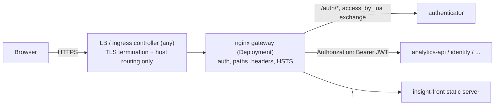
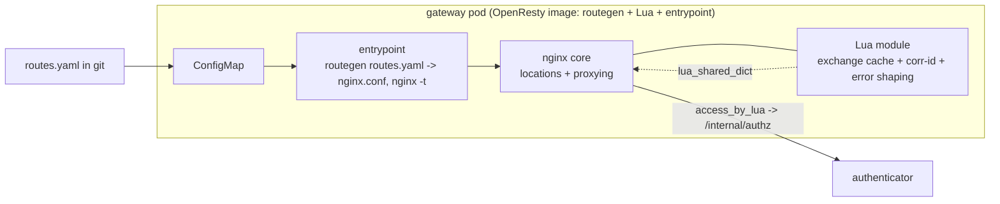
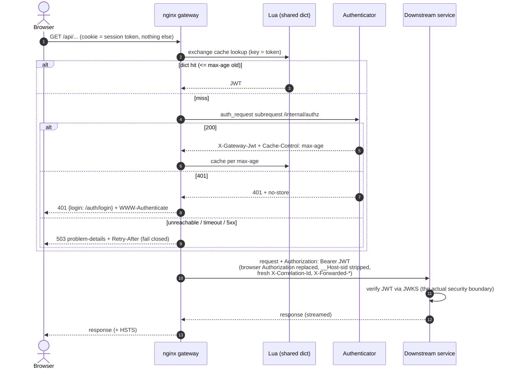

# DESIGN -- Gateway (nginx edge)

- [ ] `p3` - **ID**: `cpt-insightspec-design-gateway`

<!-- toc -->

- [1. Architecture Overview](#1-architecture-overview)
  - [1.1 Architectural Vision](#11-architectural-vision)
  - [1.2 Architecture Drivers](#12-architecture-drivers)
  - [1.3 Architecture Layers](#13-architecture-layers)
- [2. Principles & Constraints](#2-principles--constraints)
  - [2.1 Design Principles](#21-design-principles)
  - [2.2 Constraints](#22-constraints)
- [3. Technical Architecture](#3-technical-architecture)
  - [3.1 Domain Model](#31-domain-model)
  - [3.2 Component Model](#32-component-model)
  - [3.3 API Contracts](#33-api-contracts)
  - [3.4 Internal Dependencies](#34-internal-dependencies)
  - [3.5 External Dependencies](#35-external-dependencies)
  - [3.6 Interactions & Sequences](#36-interactions--sequences)
  - [3.7 Database schemas & tables](#37-database-schemas--tables)
  - [3.8 Route Configuration Schema](#38-route-configuration-schema)
  - [3.9 Generated Location Hygiene Block](#39-generated-location-hygiene-block)
  - [3.10 Subrequest Contract](#310-subrequest-contract)
  - [3.11 Lua Module](#311-lua-module)
  - [3.12 Failure Handling](#312-failure-handling)
  - [3.13 Reload Procedure](#313-reload-procedure)
  - [3.14 Observability](#314-observability)
  - [3.15 Deployment Topology](#315-deployment-topology)
- [4. Design Decisions](#4-design-decisions)
  - [DD-GW-01: nginx (OpenResty) Instead of a Custom Rust Router](#dd-gw-01-nginx-openresty-instead-of-a-custom-rust-router)
  - [DD-GW-02: Route Configurator -- Humans Never Write Locations](#dd-gw-02-route-configurator----humans-never-write-locations)
  - [DD-GW-03: Gateway-Side Exchange Cache in Lua Shared Memory](#dd-gw-03-gateway-side-exchange-cache-in-lua-shared-memory)
  - [DD-GW-04: Ingress-Orthogonal Topology](#dd-gw-04-ingress-orthogonal-topology)
  - [DD-GW-05: The Gateway Is Not the Security Boundary](#dd-gw-05-the-gateway-is-not-the-security-boundary)
  - [Carried over and known issues](#carried-over-and-known-issues)
- [5. Traceability](#5-traceability)

<!-- /toc -->

---

## 1. Architecture Overview

### 1.1 Architectural Vision

The gateway is the commodity half of the deleted API Gateway spec, implemented by the tool that has been doing exactly this work for twenty years instead of by new Rust code: an **OpenResty (nginx) deployment** that routes and proxies all browser traffic, authenticates `/api/*` requests via `auth_request` subrequests to the [authenticator](../authenticator/DESIGN.md), and injects the returned gateway JWT upstream. Streaming, WebSocket upgrades, timeouts, header rewriting, hot reload -- all stock nginx behavior.

Nobody hand-writes the nginx config. A small **route configurator** (Rust CLI, run in CI) compiles a reviewable `routes.yaml` -- the schema salvaged nearly verbatim from the deleted Router spec -- into the full `nginx.conf`, emitting the complete auth-and-hygiene block into every generated location. A small **Lua module** provides the three things stock nginx cannot: a worker-shared cookie-to-JWT exchange cache honoring the authenticator's `Cache-Control`, per-request UUIDv7 correlation ids, and RFC 9457 problem-details error shaping.

### 1.2 Architecture Drivers

The gateway consumes the contracts the authenticator PRD defines; the FR-level drivers live there.

#### Functional Drivers

| Requirement | Design Response |
|-------------|------------------|
| `cpt-insightspec-fr-auth-authz-exchange` (consumer side) | `auth_request` to `/internal/authz` behind the Lua exchange cache; `X-Gateway-Jwt` into `Authorization` |
| `cpt-insightspec-fr-auth-internal-reachability` (edge layer) | Generated `location /internal/ { return 404; }`; configurator forbids operator routes outside `/api/` |
| `cpt-insightspec-contract-auth-authz-exchange` | Cache TTL driven by response `Cache-Control`; 401 is `no-store`, never cached |
| Route table reviewability (deleted Router's `fr-router-config-*`) | `routes.yaml` in git; configurator validates in CI; `nginx -t` demoted to smoke test |
| Streaming, WebSockets, timeouts, longest-prefix routing (deleted `fr-router-proxy`, `fr-router-route-resolve`) | nginx core behavior; `location` matching is natively longest-prefix; unmatched `/api/` returns 404 |
| HSTS ownership (deleted `nfr-gw-https-only`) | The gateway sets `Strict-Transport-Security` on every response -- it is the component all traffic crosses, regardless of ingress choice |
| Fail closed (deleted `nfr-router-fail-closed`) | `auth_request` fails closed by default; Lua shapes the bare 500 into 503 + `Retry-After` problem-details |

#### NFR Allocation

The gateway carries its share of the NFRs the authenticator PRD pins:

| NFR ID | NFR Summary | Allocated To | Design Response | Verification Approach |
|--------|-------------|--------------|-----------------|----------------------|
| `cpt-insightspec-nfr-auth-exchange-p95` | Exchange within 5 ms p95; 15 ms p95 total edge overhead | Lua exchange cache | Hot path is a shared-memory lookup; only about one exchange per session per cache window per pod reaches the authenticator | Load test measured at the gateway |
| `cpt-insightspec-nfr-auth-rate-limit` | Layered `/auth/*` rate limiting | `limit_req` zone | Coarse per-IP flood guard (layer 1); precise layer 2 lives in the authenticator | Flood test: excess requests rejected at the edge before reaching the authenticator |
| `cpt-insightspec-nfr-auth-fail-closed` | No auth without a live session check | `auth_request` + error shaping | Subrequest failure never passes through -- shaped 503 + `Retry-After` per request; readiness stays local so an authenticator blip does not drain the fleet (see 3.15) | Kill the authenticator; assert per-request 503 problem-details while the gateway stays Ready and keeps serving cache hits, `/auth/*`, and the SPA |

**ADRs**: [`cpt-insightspec-adr-gw-0001-access-by-lua-over-auth-request`](specs/ADR/0001-access-by-lua-over-auth-request.md) -- the access-phase-Lua-vs-`auth_request` mechanism decision behind `DD-GW-03` (spike-validated, EPIC #1583 step 02). Remaining decisions are captured inline in [section 4](#4-design-decisions); to be extracted alongside implementation.

### 1.3 Architecture Layers

| Layer | Responsibility | Technology |
|-------|---------------|------------|
| TLS edge | TLS termination, host routing to exactly one backend | Customer-chosen ingress controller (any) |
| Gateway | Path routing, `auth_request` exchange, header hygiene, HSTS, coarse rate limiting | OpenResty (nginx + the Lua module) |
| Auth | Sessions, JWT mint and exchange | [Authenticator](../authenticator/DESIGN.md) (sibling artifact) |
| Upstreams | Business APIs and the SPA shell | Downstream services / insight-front |

The gateway is a **separate service, not bound to the ingress layer at all**. The edge chain is fixed:



- The ingress controller's only jobs are TLS termination and host routing to one backend: the gateway Service. It can be swapped (ingress-nginx to traefik / Gateway API) at any time as a pure ops track -- no auth annotations, path rules, or header logic live at the ingress.
- The gateway owns security headers (HSTS on every response) -- they ride with the component all traffic crosses.
- One hostname, one entry: `__Host-sid` pins the cookie to a single host, so the SPA is routed through the gateway too (`location /` to the insight-front static server). One origin, one TLS cert, one place where a path exists or does not.
- `/internal/*` never routes (generated 404) -- nothing external can name the authenticator.

## 2. Principles & Constraints

### 2.1 Design Principles

#### Humans never hand-edit locations

- [ ] `p2` - **ID**: `cpt-insightspec-principle-gateway-generated-config`

Every `location` block -- including the unauthenticated ones (`/auth/`, the SPA shell) -- is emitted by the configurator from `routes.yaml`. There is no location to forget the auth or hygiene directives in, because there is no hand-written location.

#### Auth at the edge is UX and efficiency, not the boundary

- [ ] `p2` - **ID**: `cpt-insightspec-principle-gateway-not-the-boundary`

Every downstream service verifies the gateway JWT itself -- mandatory, fail closed, no production disable knob. The gateway's `auth_request` turns no-session into a fast 401 with a login URL and mints the exchange once; the signature check in each service is the security boundary. The worst outcome of a gateway misconfiguration is an availability bug visible in the first smoke test, never a breach.

#### Fail closed, shaped

- [ ] `p2` - **ID**: `cpt-insightspec-principle-gateway-fail-closed`

Authenticator unreachable means deny -- but as a proper 503 with `Retry-After` and a problem-details body, never a mystery 500. Upstream 5xx pass through untouched.

### 2.2 Constraints

#### OpenResty as the shipped image

- [ ] `p2` - **ID**: `cpt-insightspec-constraint-gateway-openresty`

The shipped image is OpenResty; every plain-nginx directive runs unchanged under it. The Lua surface is deliberately tiny (see 3.11) and the stock-nginx `proxy_cache` fallback is documented as the exit path if the Lua module ever becomes a burden.

#### Routes only under `/api/`

- [ ] `p2` - **ID**: `cpt-insightspec-constraint-gateway-api-prefix`

Operator-defined routes must carry the `/api/` prefix (configurator-enforced). The non-`/api/` surface (`/auth/`, `/`, `/healthz`) is fixed and generated, never operator-extensible.

## 3. Technical Architecture

### 3.1 Domain Model

The gateway holds no business entities. The objects it owns are configuration and cache artifacts:

| Entity | Purpose | Storage |
|--------|---------|--------|
| `routes.yaml` | Reviewable route table -- the operator-facing source of truth | Git + ConfigMap (the single artifact shipped) |
| Generated `nginx.conf` | Compiled routing + hygiene configuration | Ephemeral: produced by the configurator in the container at startup, written to `tmpfs` |
| Exchange-cache entry | Session token to JWT, one cache window | `lua_shared_dict` (per pod, fixed shm, LRU) |
| Correlation id | Per-request UUIDv7 | Request-scoped, never stored |

It reads nothing else: no Redis, no database, no K8s API.

### 3.2 Component Model



#### Route Configurator

- [ ] `p2` - **ID**: `cpt-insightspec-component-gateway-configurator`

##### Why this component exists
Hand-written nginx config and syntax-only `nginx -t` validation are how auth and hygiene directives get forgotten. The configurator makes route validation semantic and location emission mechanical.

##### Responsibility scope
A small Rust CLI: `routes.yaml` in, complete validated `nginx.conf` out. Enforces the schema rules (3.8) before nginx ever sees the config; emits the full hygiene block (3.9) into every generated location; emits the fixed unauthenticated surface. Golden-file snapshot tests pin the emitted config. It ships in the gateway image and runs once at container startup (the entrypoint compiles the mounted `routes.yaml`, then `nginx -t`); CI runs its tests and the same generate-and-validate path, so an invalid table fails CI and refuses to start a pod.

##### Responsibility boundaries
Runs once at startup, not as a runtime watcher. Does not decide routing policy -- `routes.yaml` (reviewed in git, shipped as a ConfigMap) does.

##### Related components (by ID)
- `cpt-insightspec-component-gateway-nginx-core` -- consumes the generated config.

#### nginx Core

- [ ] `p2` - **ID**: `cpt-insightspec-component-gateway-nginx-core`

##### Why this component exists
The commodity edge: routing, proxying, streaming, WebSocket upgrades, timeouts, rate limiting -- the code nobody should hand-write in Rust.

##### Responsibility scope
Longest-prefix `location` matching; an access-phase Lua exchange on every `/api/` location; plain proxy for `/auth/` (with a coarse per-IP `limit_req` flood guard); SPA at `/`; `proxy_buffering off` where streaming matters; WebSocket upgrade pass-through (auth runs once at upgrade, JWT frozen for the socket's life); `/internal/` returns 404; HSTS on every response.

Access-phase Lua exchange semantics the design hangs on: authenticator `200` = allow (JWT read from the `X-Gateway-Jwt` response header); `401` = deny with that status (never cached); anything else (authenticator unreachable / timeout / 5xx) = fail closed, shaped to a `503`. The Lua cosocket calls the authenticator without the request body, so uploads are not buffered twice; the response body and any `Set-Cookie` are discarded -- fine, the design never sets cookies on `/api/*`.

##### Responsibility boundaries
Mints nothing, stores no sessions, verifies no signatures. Never reaches Redis or the IdP.

##### Related components (by ID)
- `cpt-insightspec-component-gateway-lua` -- access-phase cache and error shaping.
- `cpt-insightspec-component-auth-exchange` (authenticator) -- subrequest target.

#### Lua Module

- [ ] `p2` - **ID**: `cpt-insightspec-component-gateway-lua`

##### Why this component exists
Three requirements stock nginx cannot meet: a worker-shared exchange cache with response-driven TTLs, per-request UUIDv7 correlation ids (a cached subrequest response cannot supply them -- an id from there would repeat for a whole cache window), and RFC 9457 error shaping that distinguishes "authenticator refused" from "unreachable" from "timed out".

##### Responsibility scope
See 3.11. A straight-line chain, deliberately trivial: dict hit = done; miss = subrequest, cache per the authenticator's `Cache-Control`.

##### Responsibility boundaries
Never learns the Redis schema or exchange semantics beyond the HTTP contract (the variant where Lua reads Redis directly was considered and rejected -- it would split exchange semantics across two languages for marginal gain).

##### Related components (by ID)
- `cpt-insightspec-component-gateway-nginx-core` -- host.

### 3.3 API Contracts

- [ ] `p2` - **ID**: `cpt-insightspec-interface-gateway-edge`

- **Contracts**: consumes `cpt-insightspec-contract-auth-authz-exchange` (see 3.10); transports `cpt-insightspec-contract-auth-gateway-jwt` (injects, never inspects). JWKS (`cpt-insightspec-contract-auth-jwks-url`) is served by the authenticator directly, not fronted here
- **Technology**: HTTP/1.1 + WebSocket reverse proxy (OpenResty)
- **Location**: `nginx.conf` generated at startup from the `routes.yaml` ConfigMap; the operator-facing contract is `routes.yaml` (3.8)

**Endpoints Overview**:

| Method | Path | Description | Stability |
|--------|------|-------------|-----------|
| ANY | `/` | SPA shell, proxied to insight-front | stable |
| ANY | `/auth/*` | Plain proxy to the authenticator (no exchange -- it IS the auth); coarse `limit_req` | stable |
| ANY | `/api/**` | Access-phase Lua exchange, hygiene block, proxy to the routed upstream | stable |
| GET | `/healthz` | Static liveness + local readiness (no dependency gating) | stable |
| ANY | `/internal/*` | 404, always | stable |

JWKS is deliberately **not** an edge endpoint: it is public, read-only, and consumed by downstream services, which fetch it directly from the authenticator (the key issuer), not through the gateway -- so downstream JWT verification does not depend on the edge being up.

### 3.4 Internal Dependencies

| Dependency Module | Interface Used | Purpose |
|-------------------|----------------|----------|
| Authenticator | `GET /internal/authz` access-phase Lua call (`cpt-insightspec-contract-auth-authz-exchange`) | Cookie-to-JWT exchange; the authenticator's health is its own k8s probe, not gated into the gateway's readiness (3.15) |
| Authenticator | `/auth/*` plain proxy | Login surface (JWKS is fetched from the authenticator directly, not via the gateway) |
| insight-front | HTTP (static) | SPA shell at `/` |
| Downstream services | HTTP upstreams from `routes.yaml` | Routed business APIs |

The gateway is configuration, not code -- it consumes no SDK crates and exposes none; its inter-module contracts are the HTTP surfaces above.

### 3.5 External Dependencies

#### Ingress controller (cluster-provided)

| Dependency Module | Interface Used | Purpose |
|-------------------|---------------|---------|
| Ingress controller (any -- customer/cluster choice) | Plain HTTP behind TLS | TLS termination and host routing to the gateway Service; deliberately nothing else (see DD-GW-04) |

No other external systems: the gateway never talks to Redis, the IdP, or the K8s API.

### 3.6 Interactions & Sequences

#### API request through the gateway

**ID**: `cpt-insightspec-seq-gateway-request`

**Use cases**: `cpt-insightspec-usecase-auth-exchange` (authenticator PRD)

**Actors**: `cpt-insightspec-actor-browser-user`, `cpt-insightspec-actor-nginx-gateway`



**Description**: The hot path costs a shared-memory lookup per request; only about one exchange per session per cache window per pod reaches the authenticator.

### 3.7 Database schemas & tables

None -- the gateway is deliberately stateless: no database, no Redis, no persistent volumes. Its only mutable state is the per-pod `lua_shared_dict` exchange cache (fixed-size shared memory, native LRU; entries expire with their `Cache-Control` max-age; see 3.11), fully reconstructible from subrequests at any moment. Losing a pod loses nothing.

### 3.8 Route Configuration Schema

- [ ] `p2` - **ID**: `cpt-insightspec-design-gateway-routes-schema`

The configurator's input contract -- the deleted Router spec's `routes.yaml` schema, salvaged nearly verbatim; the contract survives the Router's death, only the compile target changed (was: in-process route trie; now: nginx.conf). One field is dropped: `websocket_max_lifetime_seconds` (nginx cannot enforce an absolute socket lifetime; see the known issues in [section 4](#carried-over-and-known-issues)).

```yaml
version: 1
defaults:
  timeout_ms: 30000
  strip_prefix: false
  websocket: false
  # Operator-extensible deny-list of request headers. The hardcoded
  # gateway-reserved set (Authorization, X-Correlation-Id,
  # X-Forwarded-*, gateway cookies) is always stripped in addition.
  strip_request_headers:
    - X-Real-IP
    - Forwarded
routes:
  - prefix: /api/analytics
    upstream: http://analytics.insight.svc.cluster.local:8081
    timeout_ms: 60000
    strip_prefix: false

  - prefix: /api/identity
    upstream: http://identity.insight.svc.cluster.local:8082

  - prefix: /api/v1/stream
    upstream: http://analytics.insight.svc.cluster.local:8081
    websocket: true
    timeout_ms: 0
```

Validation rules (enforced by the configurator in CI, before nginx ever sees the config):

- `version` must be a known schema version.
- `prefix` unique across the table; no two routes share an exact prefix.
- `prefix` must start with `/api/`.
- `upstream` must be a valid URL with hostname and port.
- `timeout_ms >= 0`; `0` only allowed when `websocket: true`.
- `strip_request_headers` entries must be valid HTTP header names; reserved gateway headers (`Authorization`, `X-Correlation-Id`, `X-Forwarded-*`, gateway cookies) **MUST NOT** appear in this list -- they are stripped unconditionally. There is no tenant selector anymore: the JWT carries a single signed `tenant_id`, so an inbound `X-Tenant-ID`/`X-Insight-Tenant-Id` is not authority and downstream ignores it (deployments may strip it for hygiene).

**Why the defaults strip `X-Real-IP` and `Forwarded` -- and how backends still get the client IP.** Those two are *inbound, client-writable* identity headers: the gateway never sets them, so any value arriving upstream could only have come from the browser -- an attacker sending `Forwarded: for=1.2.3.4` would spoof IP-based audit trails, rate-limit keys, or geo logic in any backend that reads them. Stripping them leaves exactly **one source of client-IP truth**: the `X-Forwarded-For` chain, which the gateway strips from the client unconditionally (reserved set) and re-writes itself (hygiene block item 5), resolving the true peer address via `set_real_ip_from` trust of the ingress hops. Backends read client IP from that header and nothing else; the authenticator's session records (`ip` captured at login) rely on the same chain. Same trust model as the tenant claim: an unsigned inbound header is never authority — only the signed gateway JWT is. If an upstream ever genuinely needs `X-Real-IP`, the configurator emits it gateway-written (`$remote_addr` after real-ip resolution) as a hygiene-block addition -- do not remove it from the strip list, which would reintroduce the client-writable variant.

### 3.9 Generated Location Hygiene Block

Every generated `/api/` location gets, without exception (this is what closes the deleted spec's header-hygiene and auth-bypass risks by construction):

1. `auth_request` to the internal exchange location, with `auth_request_set` capturing `X-Gateway-Jwt`.
2. `Authorization` set to the captured JWT -- replacing anything the browser sent.
3. Cookie strip: the `__Host-sid` (and CSRF) cookies never travel upstream (regex `map` over the `Cookie` header).
4. Per-request `X-Correlation-Id` (UUIDv7 from Lua; any client-supplied value stripped).
5. `X-Forwarded-For` / `X-Forwarded-Proto` / `Host` set by the gateway -- the single, gateway-authored source of client-IP truth for every upstream (client-supplied `X-Forwarded-*` is stripped unconditionally, and the client-writable alternatives `X-Real-IP` / `Forwarded` are stripped by the defaults; see the note under 3.8). `set_real_ip_from` trusts only the ingress hops (otherwise the per-IP flood-guard key silently becomes the LB address).
6. Operator `strip_request_headers` from `defaults`.
7. Per-route `proxy_read_timeout` from `timeout_ms`; WebSocket upgrade boilerplate when `websocket: true`; `proxy_buffering off`.
8. `error_page` wiring for the fail-closed exits (3.12).

CI proof: a poisoned-request snapshot test per generated route (forged `Authorization`, junk cookies, junk correlation id sent in; assert what the upstream stub receives), and a no-cookie-means-401 assertion on every `/api/` route.

### 3.10 Subrequest Contract

The gateway side of `cpt-insightspec-contract-auth-authz-exchange` ([authenticator PRD section 7.2](../authenticator/PRD.md#72-external-integration-contracts)) -- an explicit interface between two artifacts, covered by an e2e test so drift cannot go unnoticed:

| Element | Value |
|---|---|
| Subrequest target | `GET /internal/authz` on the authenticator (internal nginx location, `internal;`, request body not forwarded) |
| Allow | subrequest `200`; JWT arrives in the `X-Gateway-Jwt` response header, injected upstream as `Authorization` |
| Deny | subrequest `401` -- returned to the client with `WWW-Authenticate` and a login URL body; never cached (`no-store`) |
| Unavailable | any other subrequest outcome -- shaped to `503` + `Retry-After` (3.12) |
| Cache TTL | driven entirely by the authenticator's `Cache-Control: max-age` (bounded by its `authz_cache_max_age`, default 30 s; already discounted for the JWT travel margin) |
| Cache key | the session-token cookie value (extracted by regex `map`; `$cookie_*` variables cannot address the dash in `__Host-sid`) |

Revocation staleness price, stated honestly: logout / revoke-all / back-channel / `invalid_grant` take effect at the gateway within at most the cache max-age (default 30 s -- well inside the 300 s acceptance bound), and the cache is per gateway pod, so staleness does not grow with replicas. `authz_cache_max_age_seconds: 0` disables caching for per-request checks.

**Cookie rotation and the cache.** Because the cache key is the raw session-token value, a `200` cached against a token that the authenticator then rotates away on `/auth/refresh` keeps authorizing that *retired* token at this pod until the entry expires -- extending its effective life from the authenticator's rotation grace (`refresh_grace_ms`, default 250 ms) to at most `authz_cache_max_age` (default 30 s). This is the **same bounded staleness envelope already accepted for revocation above**, applied to rotation, and it is bounded on every axis:

- It does **not** extend a session or defeat revocation. The cached artifact is the session-linked JWT (keyed by the stable `session_id`, not the token); killing the session -- logout, revoke-all, `invalid_grant` -- still takes effect within the same max-age, and any served JWT still dies at its own `exp` (<= 300 s).
- It benefits **only** a party still presenting the old cookie. The legitimate client switched to the new cookie the instant refresh returned, so its old cache entry simply goes unused and ages out; the exposure is exactly the stolen-old-cookie case that cookie rotation targets -- and per the authenticator's own model that detection is deliberately probabilistic and noisy, not deterministic.
- The lever is explicit: `authz_cache_max_age_seconds: 0` disables the cache and returns rotation to the authenticator's 250 ms grace with per-request checks; any value in between trades authenticator load for a correspondingly shorter retired-cookie window.

A cache-purge-on-rotation hook is deliberately **not** added in v1: the gateway is intentionally a dumb, dependency-free cache (no Redis, no rotation events -- see DD-GW-03), and a per-pod invalidation channel would reintroduce exactly the coupling that design avoids, to shave a bounded 30 s window off an already-probabilistic theft-detection mechanism. If a deployment needs a tighter bound, it lowers `authz_cache_max_age`; if it needs zero, it sets `0`.

### 3.11 Lua Module

- [ ] `p2` - **ID**: `cpt-insightspec-design-gateway-lua-module`

About 50 lines of access-phase Lua plus helpers, deliberately trivial. The mechanism is the
pure `access_by_lua` exchange, **not** the stock `auth_request` directive: the two do not
compose (an `auth_request` cannot be skipped on a `lua_shared_dict` hit), so the miss-path
subrequest is issued from Lua -- a `lua-resty-http` cosocket call, which requires a `resolver`
in the `http` block. Validated end-to-end by the step-02 spike; see [`cpt-insightspec-adr-gw-0001-access-by-lua-over-auth-request`](specs/ADR/0001-access-by-lua-over-auth-request.md).

- **Exchange cache**: `lua_shared_dict jwt_cache` -- cookie token in, JWT out. Hit: set `Authorization`, done. Miss: cosocket subrequest to the exchange, cache per the response `Cache-Control` (never a non-200). The dict is a **pre-allocated fixed-size shared-memory zone with native LRU eviction**: it structurally cannot grow past its declared size (gateway OOM via cache is impossible by construction), and eviction costs one extra subrequest on the next hit for the evicted session. Sizing: an entry is cookie token + JWT, about 1.5 KB; entries expire with their max-age, so steady state tracks sessions active per cache window; the default `64m` zone covers roughly 40k concurrently active sessions -- a set-and-forget Helm value emitted by the configurator.
- **Correlation ids**: per-request UUIDv7 generated in the access phase and injected as `X-Correlation-Id` -- never read from the cacheable subrequest response. Stock-nginx `$request_id` (random hex) is the documented fallback.
- **Error shaping**: the access phase sees the subrequest outcome directly and emits RFC 9457 problem-details distinguishing refused / unreachable / timed out, with a dynamic `Retry-After` -- the same error format the toolkit's canonical errors produce, one format from the edge to the gear.

Testing scales to the module's triviality: a handful of e2e cases covering the two failure modes that would hurt silently (a cached 401; caching past the `Cache-Control` TTL) -- no unit tests for uuid generation or other plumbing.

**Documented exit path**: stock-nginx `proxy_cache` on the auth subrequest location (keyed by the cookie `map`, `proxy_cache_lock` collapsing concurrent misses -- the documented pattern for caching token introspection) delivers the same cache contract with zero code, minus the UUIDv7 and error-shaping extras. The subrequest contract is identical either way.

### 3.12 Failure Handling

Based on the decision document's failure analysis; upstream errors keep their own status codes because `proxy_intercept_errors` stays off:

| Failure | Behavior |
|---|---|
| No cookie / unknown session | 401 from the subrequest; JSON body with the login URL + `WWW-Authenticate: Session realm="insight"` (the SPA contract keys off it); never cached |
| Authenticator unreachable / timeout | fail closed: shaped `503` + problem-details + `Retry-After` (Lua tier; the stock-nginx tier via `error_page 500` inside the `/api/` block is the documented fallback) |
| Authenticator 5xx on the subrequest | same shaped 503 -- an nginx-generated 500 in an `/api/` location can only mean the auth subrequest failed |
| Upstream connection refused | 502, passed as-is |
| Upstream timeout | 504, per-route `timeout_ms` |
| Upstream 5xx | pass through untouched |
| Route not matched under `/api/` | 404 (no upstream call) |
| `/internal/*` from outside | 404, always |
| Invalid generated config at reload | `nginx -t` refuses; old workers keep serving (last-good-config) |
| Authenticator unreachable fleet-wide | gateway pods stay Ready (local readiness); each `/api/*` cache miss fails closed with a shaped 503 while cache hits, `/auth/*`, and the SPA keep serving (see 3.15) |

### 3.13 Reload Procedure

Route changes are a deploy-time pipeline, not a runtime watcher:

1. Edit `routes.yaml` in git; review the PR. It is shipped verbatim as the ConfigMap -- the single reviewable artifact (reviewability carried over from the deleted Router's ConfigMap decision).
2. CI runs the configurator's own tests and validates the emitted config with `nginx -t` on the real image (via the container's generate-and-validate path); an invalid table fails CI, never a pod.
3. The chart ships `routes.yaml` in the ConfigMap; the container compiles it into `nginx.conf` at startup (routegen entrypoint), running `nginx -t` before it serves -- a broken table refuses to start rather than serving stale.
4. A route change rolls the pods (checksum-annotation on the ConfigMap). Each new pod regenerates and validates its config on start; a bad table is caught by `nginx -t` at startup, and the old pods keep serving until the new ones pass readiness -- the "keep last good table" behavior the deleted Router spec demanded, minus the custom watcher code.
5. Rolling pods drains old connections on termination (`terminationGracePeriodSeconds`) -- blunter than the deleted spec's per-route WebSocket sweep; acceptable, clients reconnect.

Config-change audit events are emitted from CI/CD (the routes.yaml PR) rather than a runtime watcher.

### 3.14 Observability

Edge observability is deliberately three sources (degraded against the deleted Router's in-process histograms -- accepted):

- **JSON access logs** (status, duration, upstream time, route, correlation id) -- the per-request source of truth, shipped to the log pipeline. Never log cookie values or JWTs.
- **nginx-prometheus-exporter** for basics (connections, requests, statuses).
- **Authenticator metrics** -- which, behind the exchange cache, see only cache misses; per-request counters come from the access logs, not the authenticator.

### 3.15 Deployment Topology

- [ ] `p3` - **ID**: `cpt-insightspec-topology-gateway`

One OpenResty Deployment behind the single ingress backend, per the edge chain fixed in 1.3 (a single replica suffices; scale out horizontally as load requires -- the exchange cache is per pod, so replicas need no coherence machinery):

- Image: OpenResty carrying the Lua module, the `routegen` binary, and an entrypoint; `routes.yaml` is mounted from the ConfigMap and compiled to `nginx.conf` on startup (nothing baked or committed). Deployment settings (authenticator URL, front URL, DNS resolver, trusted proxy CIDRs) arrive as env vars.
- Config changes roll the pods (checksum-annotation); each pod regenerates + `nginx -t` on start (3.13).
- Probes: liveness = static `/healthz`; **readiness = local only** (nginx workers accepting connections + a valid config loaded). Readiness is deliberately **not** gated on the authenticator: coupling a caching reverse proxy's readiness to a downstream dependency turns a transient auth blip into a fleet-wide outage -- every pod drops from the Service endpoints at once, draining the very exchange cache meant to absorb the blip and taking down cache hits, `/auth/*` login, and SPA delivery along with it. The gateway already degrades gracefully per request (cache hits keep serving; each `/api/*` cache miss fails closed with a shaped 503 + `Retry-After`), so a Ready-but-degraded pod is strictly better than a NotReady one. The authenticator runs its own k8s liveness/readiness probes (it is a separate Deployment) -- the gateway does not re-expose a dependency-health endpoint.
- A writable `tmpfs` (`/tmp`) for the generated config, pid, and nginx temp paths; otherwise no volumes, no Redis, no K8s API access -- pods are disposable (3.7).

## 4. Design Decisions

### DD-GW-01: nginx (OpenResty) Instead of a Custom Rust Router

**Decision**: Delete the planned Rust Router module; nginx does the routing and proxying.

**Why**:
- The Router spec was about half proxy plumbing -- streaming bodies, WebSocket upgrade registry, route-table hot reload, header rewriting, per-route timeouts. Every one of those is a bug class in fresh Rust code handling hostile input at the edge, and a solved problem in nginx.
- The security-critical core (the authenticator) gets smaller and more testable by not living in a proxy binary.
- `auth_request` is the same contract as Envoy `ext_authz` / Traefik `forwardAuth` -- the authenticator is not married to nginx.
- Ops already run nginx twice in this stack; `curl` + access logs beat debugging a custom proxy.
- Less privileged runtime: no K8s API RBAC for ConfigMap/Secret watches -- mounted files only.

**Consequences**: One extra in-cluster hop on exchange-cache misses (absorbed by DD-GW-03; the 15 ms p95 budget holds comfortably); edge observability degrades to three sources (3.14); the WebSocket absolute-lifetime cap is lost at the edge (known issue below); the deleted `nfr-gw-single-binary` NFR is retired deliberately.

### DD-GW-02: Route Configurator -- Humans Never Write Locations

**Decision**: `routes.yaml` (salvaged schema) in git; a Rust CLI compiles it to the full `nginx.conf` in CI with semantic validation and golden-file snapshot tests; every generated location carries the full hygiene block; `nginx -t` is a smoke test, not the validation.

**Why**:
- Hand-written nginx config is how a route ships without `auth_request` or with a leaky `Cookie` header. Generation removes the place to make that mistake; per the not-the-boundary principle the residual risk is availability, not security.
- Keeps the deleted spec's reviewability (routes are a PR) and its validation rules, moved earlier in the pipeline -- invalid YAML fails CI, never the pod.

**Consequences**: New services need a `routes.yaml` PR (documented in the operator runbook). The configurator is a small, unit-testable CLI on the same Rust stack.

### DD-GW-03: Gateway-Side Exchange Cache in Lua Shared Memory

**Decision**: Cache the cookie-to-JWT exchange per gateway pod in a `lua_shared_dict`, TTL driven by the authenticator's `Cache-Control`; only misses travel to the authenticator.

**Why**:
- Removes the per-request hop (the honest cost of splitting auth from routing); authenticator load drops from every-request to at most a couple of requests per minute per session per pod.
- The authenticator stays in control of cacheability by construction: max-age is already discounted for the JWT travel margin, and non-200 is `no-store` (never cache a rejection over a fresh login).
- Fixed-size shm with native LRU makes memory safety free -- the same bounded-cache philosophy the deleted spec chose for its Redis JWT cache.
- Having Lua at the edge pays twice more: per-request UUIDv7 correlation ids and RFC 9457 error shaping.

**Consequences**: Revocation reaches the gateway within max-age (default 30 s, bound stated in 3.10); per-pod caching means no cross-replica coherence machinery and no growth of staleness with replicas. The Lua-reads-Redis variant stays rejected (splits exchange semantics across two languages); the stock `proxy_cache` fallback stays documented as the exit.

### DD-GW-04: Ingress-Orthogonal Topology

**Decision**: The gateway is a separate Deployment behind whatever terminates TLS; the ingress routes one host to one backend and does nothing else. The SPA rides through the gateway.

**Why**:
- ingress-nginx is retired upstream; swapping the ingress controller must be a pure ops track with zero impact on auth -- so nothing auth- or path-related may live at the ingress.
- Security headers belong to the component all traffic crosses, not to whichever ingress happens to be installed.
- `__Host-sid` requires one hostname; routing the SPA through the gateway gives one origin, one cert, one entry point.

**Consequences**: One extra proxy hop for static SPA assets -- negligible. The gateway stays plain HTTP behind the ingress.

### DD-GW-05: The Gateway Is Not the Security Boundary

**Decision**: Every downstream service verifies the gateway JWT itself -- mandatory, fail closed, no production disable knob. The gateway's auth is UX and hot-path efficiency.

**Why**: In the deleted Rust Router, auth was structural (every request passed the middleware chain by construction); in nginx it is per-location config. The containment is this rule: a route missing auth means a JWT-less request downstream and a 401 -- an availability bug caught by the first smoke test, never a breach. This is what zero trust means here: no service trusts network position, headers, or another service's word; only the signature.

**Consequences**: CI asserts every `/api/` route returns 401 without a cookie; downstream verification ships as one shared middleware so a new service gets the boundary by adding a dependency.

**Realized (step 07)**: The algorithm is **ES256** (§9.6, ECDSA P-256) — smaller signatures (~64 B vs RSA's ~256 B) and faster verify, both paid on every downstream request. Downstream verification is entirely **plugin-native**: Rust services enable host auth via the **upstream `cf-gears-oidc-authn-plugin`** (the insight-local fork and the bespoke `authverify` crate are both **deleted**), which verifies signature / `iss` / `aud` / `exp` / the required `tenant_id` and maps the signed claims straight to a `SecurityContext` via configured `claim_mapping` (`sub`→`subject_id`, `tenant_id`→`subject_tenant_id`, `sub_type`→`subject_type`, `roles`→`token_scopes`). There is **no tenant selector**: the JWT carries a single signed `tenant_id`, so the `X-Tenant-ID`/`X-Insight-Tenant-Id` header trust paths are gone (a tenant from the outside world never passes). analytics adopts the plugin (its `auth_disabled` trust path deleted). identity (.NET) turns on full `JwtBearer` validation (pinned to `EcdsaSha256`) against the authenticator's JWKS, reads the caller from `sub` and the tenant from the single `tenant_id` claim, and fails closed via a `RequireAuthenticatedUser` fallback policy. The plugin resolves the JWKS via OIDC **discovery** (`{issuer}/.well-known/openid-configuration` → `jwks_uri`) over **https only**; in production the issuer is a real https origin, and in dev/e2e a self-signed TLS front serves the authenticator's well-known endpoints (trusted via `http_client.custom_ca_certificate_paths`). Proven end-to-end by `services/gateway/tests/step07/` (the §D scenarios).

### Carried over and known issues

- **DD-ROUTER-02 (reviewable route table in git)** -- carried over; the review artifact is `routes.yaml`, the runtime artifact is the generated config.
- **WebSocket absolute-lifetime cap -- known issue, deferred with eyes open**: nginx can only idle-timeout a socket (`proxy_read_timeout`), not enforce the deleted DD-ROUTER-07's absolute `websocket_max_lifetime_seconds` (the post-revoke staleness bound). No WebSocket code exists in the stack today, so nothing ships with this gap; when a WS feature lands, the downstream WS handler enforces max lifetime (it holds the JWT and its `exp`; closing at `exp` + grace is a few lines there). The same bound covers role-change staleness on open sockets.
- **Close-WS-on-route-removal** -- blunter than the deleted spec: reload + `worker_shutdown_timeout` closes all old-worker connections, not per-route. Accepted.
- **Coarse per-IP `limit_req` on `/auth/*`** -- layer 1 only (order of 60 r/min, burst above the biggest expected office); precise limiting lives in the authenticator (layer 2). The big refresh jitter is what makes legitimate steady-state traffic smooth enough for this split; `set_real_ip_from` must trust only the ingress hops. nginx `limit_req` zones are per-pod; if the gateway ever scales past a few replicas and needs exact global limits, the authenticator's Redis token bucket is already the authoritative layer.

## 5. Traceability

- **Sibling**: [Authenticator PRD](../authenticator/PRD.md), [Authenticator DESIGN](../authenticator/DESIGN.md) -- session lifecycle, exchange contract (`cpt-insightspec-contract-auth-authz-exchange`), JWT claim contract, JWKS
- **Parent**: [Backend PRD](../specs/PRD.md), [Backend DESIGN](../specs/DESIGN.md)
- **Decision document**: the nginx + authorization analysis (workspace-level) that mandated this architecture
- **ADRs**: [ADR-0001](specs/ADR/0001-access-by-lua-over-auth-request.md) (`cpt-insightspec-adr-gw-0001-access-by-lua-over-auth-request`) -- access-phase Lua over `auth_request` for the exchange (`DD-GW-03`), spike-validated. Remaining decisions captured inline in section 4 until extracted alongside implementation.
