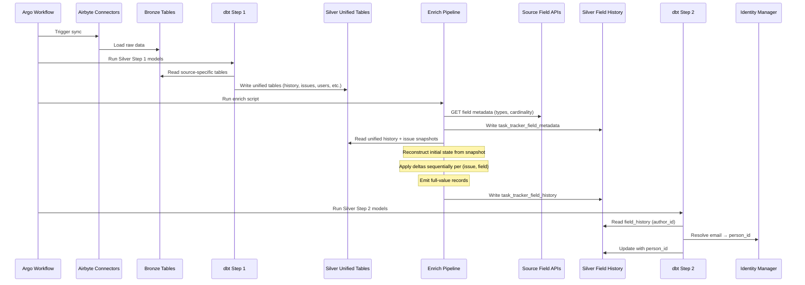

# Technical Design — Task Tracking Silver Layer

- [ ] `p1` - **ID**: `cpt-insightspec-design-tt-silver`

## Table of Contents
<!-- generated by `cfs toc` -->

## 1. Architecture Overview

### 1.1 Architectural Vision

The Task Tracking Silver Layer transforms raw changelog deltas from multiple task tracking systems into unified records where every field change contains the **complete field value**, not just what changed. This eliminates the need for downstream consumers to perform complex delta accumulation.

The architecture follows a four-step pipeline: Bronze (raw API data) -> dbt Step 1 (unified schema) -> Enrich (delta-to-full-value transformation) -> dbt Step 2 (Identity Resolution). The Enrich step is a stateful Python process that maintains running field state per issue, applying deltas sequentially and emitting full-value records. This step cannot be implemented in pure SQL due to the sequential nature of multi-value field accumulation.

The design supports four source systems with fundamentally different changelog semantics: YouTrack (added/removed arrays of objects), Jira (from/to with display strings), GitHub Projects V2 (no changelog — snapshot polling), and Azure DevOps (oldValue/newValue with Tags as full snapshots). The unified schema abstracts these differences while preserving source-specific identifiers.

### 1.2 Architecture Drivers

**ADRs**: None yet — to be created if architectural decisions require formal documentation.

#### Functional Drivers

| Requirement | Design Response |
|-------------|-----------------|
| `cpt-insightspec-fr-tt-silver-full-value` — Full-value field history | `task_tracker_field_history` table with `value_ids`/`value_displays` arrays containing complete field state |
| `cpt-insightspec-fr-tt-silver-multi-source` — Multi-source unification | Single table schema with `data_source` discriminator; source-specific logic isolated in Enrich adapters |
| `cpt-insightspec-fr-tt-silver-initial-state` — Initial state capture | Enrich reconstructs initial state from current issue snapshot minus all changelog deltas |
| `cpt-insightspec-fr-tt-silver-cardinality` — Field cardinality tracking | `field_cardinality` enum column; cardinality determined from source field metadata API |
| `cpt-insightspec-fr-tt-silver-field-metadata` — Field metadata collection | `task_tracker_field_metadata` table populated from source APIs each sync run |
| `cpt-insightspec-fr-tt-silver-value-id-type` — Value ID type classification | `value_id_type` enum: opaque_id, account_id, string_literal, path, none |

#### NFR Allocation

| NFR ID | NFR Summary | Allocated To | Design Response | Verification Approach |
|--------|------------|-------------|-----------------|----------------------|
| `cpt-insightspec-nfr-tt-silver-incremental` | Incremental processing | Enrich Pipeline | Cursor-based: process only events after last checkpoint | Measure processing time vs event count |
| `cpt-insightspec-nfr-tt-silver-dedup` | Idempotent re-ingestion | ClickHouse ReplacingMergeTree | `_version` column ensures last-write-wins dedup | Re-run sync and verify row counts |
| `cpt-insightspec-nfr-tt-silver-freshness` | Data freshness | Argo DAG | Pipeline completes within Argo timeout | Monitor Argo workflow duration |

### 1.3 Architecture Layers

```
┌─────────────────────────────────────────────────────┐
│                    Gold Layer                         │
│  Cycle time, throughput, WIP, sprint velocity         │
└──────────────────────┬──────────────────────────────┘
                       │
┌──────────────────────┴──────────────────────────────┐
│              Silver Step 2 (dbt)                      │
│  Identity Resolution: author_id → person_id           │
└──────────────────────┬──────────────────────────────┘
                       │
┌──────────────────────┴──────────────────────────────┐
│           Enrich (Python script)                      │
│  Delta → full value accumulation                      │
│  Field metadata collection                            │
│  Initial state reconstruction                         │
└──────────────────────┬──────────────────────────────┘
                       │
┌──────────────────────┴──────────────────────────────┐
│             Silver Step 1 (dbt)                       │
│  Bronze → unified schema normalization                │
└──────────────────────┬──────────────────────────────┘
                       │
┌──────────────────────┴──────────────────────────────┐
│                  Bronze Layer                          │
│  YouTrack │ Jira │ GitHub Projects │ Azure DevOps      │
└─────────────────────────────────────────────────────┘
```

- [ ] `p1` - **ID**: `cpt-insightspec-tech-tt-silver-layers`

| Layer | Responsibility | Technology |
|-------|---------------|------------|
| Bronze | Raw API data storage | Airbyte connectors, ClickHouse |
| Silver Step 1 | Source-specific normalization to unified schema | dbt-clickhouse |
| Enrich | Delta-to-full-value transformation, field metadata collection | Python script (Argo step) |
| Silver Step 2 | Identity resolution (person_id assignment) | dbt-clickhouse + Identity Manager |
| Gold | Aggregated metrics (cycle time, velocity, throughput) | dbt-clickhouse |

## 2. Principles & Constraints

### 2.1 Design Principles

#### Full Values Over Deltas

- [ ] `p1` - **ID**: `cpt-insightspec-principle-tt-silver-full-values`

Every record in `task_tracker_field_history` contains the complete field state after the event. Consumers never need to accumulate deltas.

#### Source-Agnostic Schema

- [ ] `p1` - **ID**: `cpt-insightspec-principle-tt-silver-source-agnostic`

The unified schema does not normalize source-specific field IDs. `field_id` is stored as-is from the source. Cross-system field mapping is a separate concern.

#### Field IDs as Source Truth

- [ ] `p2` - **ID**: `cpt-insightspec-principle-tt-silver-field-ids`

Where source systems provide value IDs, those IDs are stored in `value_ids`. Where no ID exists (Jira labels, Azure DevOps tags), the string value itself serves as the identifier, classified as `string_literal`.

#### Unified Status Category

- [ ] `p1` - **ID**: `cpt-insightspec-principle-tt-silver-status-category`

Task "closedness" — and the coarse lifecycle axis `new` / `in_progress` / `done` — is derived from a **source-neutral `status_category`**, never from a status *display name*. Every source maps its own done-signal onto the same three-value axis:

- **Jira** — from `statusCategory` (`key` ∈ `new`/`indeterminate`/`done`/`undefined`, equivalently `id` `2`/`4`/`3`/`1`).
- **YouTrack** — from the State-bundle value's `isResolved` flag (corroborated by the issue-level `resolved` timestamp).
- **Azure DevOps** — from `System.State` category (`Proposed`/`InProgress`/`Resolved`/`Completed`/`Removed`).
- **GitHub Projects V2** — from the Status single-select option mapped to the same three states.

Consumers (Gold close-detection) filter on `status_category = 'done'`. They **must not** match localized labels such as `Closed` / `Resolved` / `Verified` / `Готово` / `Done` — a display name is not a lifecycle signal and varies by workflow, project template, and locale.

The mapping lives in the `task_tracker_statuses` dimension (§3.7), keyed by `status_id` — the same id carried in `task_tracker_field_history.value_ids[1]` for the status field. It is **not** denormalized onto the event log, so the Enrich contract is untouched, and each source populates its own per-source projection of the dimension using its native done-signal.

In the shipped design (#1541), Gold joins `class_task_statuses` on `value_ids[1]` inside `task_issue_current_state` / `task_status_intervals` to attach the reconciled `status_category`; every downstream close/reopen/dev/stale object then reads that column and matches no label. Because each per-source projection already reconciles to the same `status_category` enum, Gold carries no per-source status logic — only the neutral category. The end-state (§3.7 `task_tracker_status_history`) would move this join into a Silver model so Gold performs no join at all; that refinement is tracked as a follow-up.

### 2.2 Constraints

#### ClickHouse SQL Limitations

- [ ] `p1` - **ID**: `cpt-insightspec-constraint-tt-silver-no-recursive`

ClickHouse does not support reliable recursive CTEs for production workloads. Multi-value field accumulation cannot be implemented in dbt SQL and requires a separate Python step.

#### Source Changelog Gaps

- [ ] `p1` - **ID**: `cpt-insightspec-constraint-tt-silver-changelog-gaps`

YouTrack and Jira do not include creation-time field values in their changelog APIs. GitHub Projects V2 has no changelog API for project-level fields. These gaps must be filled by the Enrich step.

## 3. Technical Architecture

### 3.1 Domain Model

**Technology**: ClickHouse (ReplacingMergeTree)

**Location**: Silver database namespace

**Core Entities**:

| Entity | Description | Schema |
|--------|------------|--------|
| Field History Record | A single field change event with full value | `task_tracker_field_history` |
| Field Metadata | Field type definition from source API | `task_tracker_field_metadata` |
| Worklog | Logged time per issue | `task_tracker_worklogs` |
| Comment | Issue comment | `task_tracker_comments` |
| Project | Project directory entry | `task_tracker_projects` |
| Sprint | Sprint/iteration metadata | `task_tracker_sprints` |
| User | Source system user directory | `task_tracker_users` |
| Issue Link | Dependency between issues | `task_tracker_issue_links` |

**Relationships**:

- `task_tracker_field_history.author_id` -> `task_tracker_users.user_id` (who made the change)
- `task_tracker_field_history.id_readable` -> `task_tracker_worklogs.id_readable` (same issue)
- `task_tracker_field_history.id_readable` -> `task_tracker_comments.id_readable` (same issue)
- `task_tracker_users.email` -> Identity Manager -> `person_id` (Silver Step 2)

### 3.2 Component Model

#### Enrich Pipeline (out of scope — summarized for context)

- [ ] `p1` - **ID**: `cpt-insightspec-component-tt-silver-enrich`

##### Why this component exists

Source systems deliver deltas, not full values. The Enrich Pipeline is the stateful process that maintains running field state per issue, applies deltas sequentially, and emits full-value records. It also collects field metadata from source APIs.

##### Responsibility scope

- Read source deltas from Bronze/Silver Step 1
- Maintain running field state per (issue_id, field_id)
- Query field metadata APIs to determine field cardinality and value ID types
- Reconstruct initial state from current issue snapshot
- Write enriched records to `task_tracker_field_history`
- Write field metadata to `task_tracker_field_metadata`

##### Responsibility boundaries

- Does NOT perform identity resolution (Silver Step 2)
- Does NOT compute Gold metrics
- Does NOT normalize field IDs across systems
- Implementation details defined in a separate spec

##### Related components (by ID)

- `cpt-insightspec-actor-tt-silver-enrich-pipeline`

### 3.3 API Contracts

Not applicable — Silver layer exposes ClickHouse tables, not API endpoints.

### 3.4 Internal Dependencies

| Dependency Module | Interface Used | Purpose |
|-------------------|----------------|---------|
| dbt-clickhouse | SQL models | Silver Step 1 normalization, Silver Step 2 identity resolution |
| Identity Manager | email -> person_id mapping | Silver Step 2 |

### 3.5 External Dependencies

| Dependency | Interface Used | Purpose |
|------------|----------------|---------|
| YouTrack API | `GET /api/admin/customFieldSettings/customFields`, `GET /api/admin/projects/{id}/customFields` | Field metadata (type, cardinality, per-project overrides) |
| Jira API | `GET /rest/api/3/field` | Field metadata (schema.type, schema.items) |
| GitHub GraphQL API | Schema introspection for ProjectV2 fields | Field metadata (type, options) |
| Azure DevOps API | `GET /_apis/wit/fields` | Field metadata (type, usage) |

### 3.6 Interactions & Sequences

#### Sync Pipeline Run

**ID**: `cpt-insightspec-seq-tt-silver-sync`

**Use cases**: `cpt-insightspec-usecase-tt-silver-cycle-time`, `cpt-insightspec-usecase-tt-silver-sprint-carryover`, `cpt-insightspec-usecase-tt-silver-cross-system`

**Actors**: `cpt-insightspec-actor-tt-silver-enrich-pipeline`, `cpt-insightspec-actor-tt-silver-identity-manager`, `cpt-insightspec-actor-tt-silver-connectors`



### 3.7 Database schemas & tables

- [ ] `p1` - **ID**: `cpt-insightspec-db-tt-silver`

#### Table: `task_tracker_field_history`

**ID**: `cpt-insightspec-dbtable-tt-silver-field-history`

Core table — every field change with full value after the event.

| Column | Type | Constraints | Description |
|--------|------|-------------|-------------|
| `insight_source_id` | String | REQUIRED | Connector instance identifier (e.g., `youtrack-acme`, `jira-alpha`) |
| `data_source` | String | REQUIRED | Source type: `youtrack`, `jira`, `github_projects`, `azure_devops` |
| `issue_id` | String | REQUIRED | Source-internal issue ID |
| `id_readable` | String | REQUIRED | Human-readable issue key (e.g., `MON-42`, `PROJ-123`, `#42`) |
| `event_id` | String | REQUIRED | Source event/changelog ID |
| `event_at` | DateTime64(3) | REQUIRED | When the change happened |
| `author_id` | String | NULLABLE | Who made the change — source user ID |
| `author_display` | String | NULLABLE | Author display name (denormalized) |
| `field_id` | String | REQUIRED | Machine field ID as-is from source (e.g., `System.State`, `customfield_10020`, `Assignee`) |
| `field_name` | String | REQUIRED | Human-readable field name (e.g., `State`, `Sprint`, `Assignee`) |
| `field_cardinality` | Enum8('single' = 1, 'multi' = 2) | REQUIRED | Whether field holds single or multiple values |
| `delta_action` | Enum8('set' = 1, 'add' = 2, 'remove' = 3) | REQUIRED | `set` = replace single value, `add` = added to multi, `remove` = removed from multi |
| `delta_value_id` | String | NULLABLE | ID of the changed value (or string literal for labels/tags) |
| `delta_value_display` | String | NULLABLE | Display name of the changed value |
| `value_ids` | Array(String) | REQUIRED | All value IDs after this event. Single = `[one]`, Multi = `[many]`, Empty = `[]` |
| `value_displays` | Array(String) | REQUIRED | All display names, parallel to `value_ids` |
| `value_id_type` | Enum8('opaque_id' = 1, 'account_id' = 2, 'string_literal' = 3, 'path' = 4, 'none' = 5) | REQUIRED | What kind of identifier is in `value_ids` |
| `collected_at` | DateTime64(3) | REQUIRED | Ingestion timestamp |
| `_version` | UInt64 | REQUIRED | ReplacingMergeTree deduplication version |

**Engine**: `ReplacingMergeTree(_version)`

**ORDER BY**: `(insight_source_id, data_source, issue_id, field_id, event_at, event_id)`

**Indexes**:
- `idx_fh_issue`: `(insight_source_id, data_source, issue_id)`
- `idx_fh_readable`: `(insight_source_id, data_source, id_readable)`
- `idx_fh_field`: `(field_id, data_source)`
- `idx_fh_event_at`: `(event_at)`
- `idx_fh_author`: `(author_id, data_source)`

**Initial state**: When an issue is created with N fields filled, N rows are inserted with `delta_action = 'set'` (single) or `delta_action = 'add'` (multi), each containing the full initial value. All share the same `event_id`.

**Previous value**: Not stored explicitly. Previous state = `value_ids`/`value_displays` of the preceding row for the same `(insight_source_id, issue_id, field_id)` ordered by `event_at`.

---

#### Table: `task_tracker_field_metadata`

**ID**: `cpt-insightspec-dbtable-tt-silver-field-metadata`

Field type snapshots from source API — one row per field per sync run where metadata is observed.

| Column | Type | Constraints | Description |
|--------|------|-------------|-------------|
| `insight_source_id` | String | REQUIRED | Connector instance |
| `data_source` | String | REQUIRED | Source type |
| `project_key` | String | NULLABLE | Project scope; NULL for global fields |
| `field_id` | String | REQUIRED | Machine field ID |
| `field_name` | String | REQUIRED | Display name |
| `is_multi` | UInt8 | REQUIRED | 1 = multi-value, 0 = single-value |
| `field_type` | String | REQUIRED | Source-specific type string (e.g., `enum[1]`, `array/component`, `string`) |
| `has_id` | UInt8 | REQUIRED | 1 = values have IDs, 0 = string-literal values |
| `observed_at` | DateTime64(3) | REQUIRED | When this metadata was captured |
| `_version` | UInt64 | REQUIRED | ReplacingMergeTree deduplication version |

**Engine**: `ReplacingMergeTree(_version)`

**ORDER BY**: `(insight_source_id, data_source, field_id, project_key, observed_at)`

**Notes**:
- dbt `snapshot` macro (SCD Type 2) can be applied to track when field types change over time
- YouTrack: field types can change at runtime (`enum[1]` -> `enum[*]`) — same `field_id`, different `is_multi`
- Jira: field types cannot change; custom fields are recreated with new `field_id`
- Queried each sync run from source field metadata APIs

**Field type detection per source**:

| Source | API | Single/Multi rule | Has ID rule |
|--------|-----|-------------------|-------------|
| YouTrack | `GET /api/admin/customFieldSettings/customFields` | `[1]` = single, `[*]` = multi in `fieldType.id` | Always yes (objects with `id`) |
| Jira | `GET /rest/api/3/field` | `schema.type == "array"` = multi | `schema.items != "string"` = has ID |
| GitHub Projects V2 | GraphQL schema introspection | All single (no multi-value custom fields) | Yes for Iteration; N/A for others |
| Azure DevOps | `GET /_apis/wit/fields` | Only Tags is multi (system field) | No (Tags = string; IterationPath = path) |

---

#### Table: `task_tracker_statuses`

**ID**: `cpt-insightspec-dbtable-tt-silver-statuses`

Status dimension — one row per source status, mapping the source `status_id` to a **unified lifecycle category**. This is the join target that lets Gold detect "done" independently of status display name or locale (see principle `cpt-insightspec-principle-tt-silver-status-category`). Produced by dbt Step 1 from each source's status lookup and unioned by `data_source`:

- **Jira** — `bronze_jira.jira_statuses` (from `GET /rest/api/3/status`), carrying `statusCategory.id` / `.key` / `.name`.
- **YouTrack** — State-bundle values from `bronze_youtrack.youtrack_project_custom_fields` (the State custom field's `bundle.values[]`, each with `isResolved`).

| Column | Type | Constraints | Description |
|--------|------|-------------|-------------|
| `insight_source_id` | String | REQUIRED | Connector instance |
| `data_source` | String | REQUIRED | Source type |
| `status_id` | String | REQUIRED | Source status id — joins `task_tracker_field_history.value_ids[1]` where `field_id='status'` |
| `status_name` | String | REQUIRED | Source display label (localized — informational only, never used for logic) |
| `category_id` | Nullable(Int32) | NULLABLE | Source-native category id when available (Jira `statusCategory.id`) |
| `category_key` | String | NULLABLE | Source-native stable category key when available (Jira `statusCategory.key`) |
| `status_category` | Enum8('new'=1,'in_progress'=2,'done'=3,'undefined'=4) | REQUIRED | **Unified, source-neutral lifecycle** — the only field Gold reads |
| `collected_at` | DateTime64(3) | REQUIRED | Ingestion timestamp |
| `_version` | UInt64 | REQUIRED | ReplacingMergeTree deduplication version |

**Engine**: `ReplacingMergeTree(_version)`

**ORDER BY**: `(insight_source_id, data_source, status_id)`

**Unified category mapping**:

| Source | Native signal | → `status_category` |
|--------|---------------|---------------------|
| Jira | `statusCategory.key` = `new` / `indeterminate` / `done` / `undefined` (ids `2` / `4` / `3` / `1`) | `new` / `in_progress` / `done` / `undefined` |
| YouTrack | State value `isResolved = true` → done; otherwise `new` (never entered) / `in_progress` (best-effort) | `done` / `new` / `in_progress` |

> **Implementation status (shipped — issue #1541 / PR #1732):** `class_task_statuses`
> is built (Jira via `jira__task_statuses`; YouTrack projection dormant until its
> silver rollout), and Gold detects "done" by `status_category` instead of the old
> `status_name IN ('Closed','Resolved','Verified')`. See [task-metrics-map.md](../../specs/task-metrics-map.md)
> for the metric-level recipes over this table.

---

#### Table: `task_tracker_status_history`

**ID**: `cpt-insightspec-dbtable-tt-silver-status-history`

> **Implementation status (shipped in issue #1541 / PR #1732):** this
> `task_tracker_status_history` model is a **future refinement and is NOT built
> today**. The shipped design attaches the reconciled `status_category` by
> joining `class_task_statuses` **directly in the Gold layer** —
> `insight.task_issue_current_state` and `insight.task_status_intervals` LEFT
> JOIN `silver.class_task_statuses` on `value_ids[1] = status_id` and expose
> `status_category`, which every downstream close/reopen/dev/stale object then
> filters on. Materializing this join once as a Silver `class_task_status_history`
> model (so Gold performs no join at all) remains the intended end-state; it is
> tracked as a follow-up, not part of #1541.

**Source-neutral status stream — the intended single status object Gold consumes, and the point at which all cross-source divergence is resolved.** One row per status-change event, built as `task_tracker_field_history` (`field_id='status'`) LEFT JOIN `task_tracker_statuses` on `status_id = value_ids[1]`.

| Column | Type | Constraints | Description |
|--------|------|-------------|-------------|
| `insight_source_id` | String | REQUIRED | Connector instance |
| `data_source` | String | REQUIRED | Source type |
| `issue_id` | String | REQUIRED | Issue |
| `id_readable` | String | REQUIRED | Human-readable key |
| `event_at` | DateTime64(3) | REQUIRED | When the status changed |
| `event_kind` | Enum8('changelog'=1,'initial'=2) | REQUIRED | Real transition vs synthetic initial |
| `author_id` | Nullable(String) | NULLABLE | Who changed it |
| `status_id` | String | REQUIRED | Source status id (= `value_ids[1]`) |
| `status_name` | String | REQUIRED | Localized label — informational only, never used for logic |
| `status_category` | Enum8('new'=1,'in_progress'=2,'done'=3,'undefined'=4) | REQUIRED | **Reconciled lifecycle — the only status signal crossing into Gold** |
| `is_closed` | UInt8 | REQUIRED | `status_category = 'done'`, precomputed |
| `_version` | UInt64 | REQUIRED | ReplacingMergeTree deduplication version |

**Engine**: `ReplacingMergeTree(_version)`

**ORDER BY**: `(insight_source_id, data_source, issue_id, event_at)`

**Reconciliation boundary**: every source difference — Jira `statusCategory` vs YouTrack `isResolved`, English vs localized labels, per-project custom workflows — is reconciled in each per-source projection of `task_tracker_statuses`, which emits the same `status_category` enum. In the shipped design (#1541) Gold's `task_issue_current_state`, `task_status_intervals`, and close/reopen views obtain `status_category` by joining `class_task_statuses` on `value_ids[1]` and then contain **zero** status-name literals. (The end-state above would move that join into this Silver model so Gold performs no join at all.)

**Completeness guarantee (no silent divergence)**: a status event whose `status_id` has no matching row in `task_tracker_statuses` resolves to `status_category = 'undefined'` — never to a guessed label. A dbt data test (`assert_status_ids_mapped`) asserts that the `undefined`-because-unmapped set is empty, so a missing dimension row (e.g. a project-scoped status not returned by the global lookup) surfaces as a **failing test**, not as a silently zeroed closed-task count — the exact failure mode of issue #1541.

---

#### Supporting Tables (unchanged)

The following tables retain their schemas as defined in the [current Silver spec](../../README.md). They are populated by dbt Step 1 from Bronze and consumed alongside `task_tracker_field_history`.

##### `task_tracker_worklogs`

**ID**: `cpt-insightspec-dbtable-tt-silver-worklogs`

Logged time per issue. PK: `(insight_source_id, worklog_id)`. Fields: `id_readable`, `author_id`, `work_date`, `duration_seconds`, `description`, `data_source`, `collected_at`, `_version`.

##### `task_tracker_comments`

**ID**: `cpt-insightspec-dbtable-tt-silver-comments`

Issue comments. PK: `(insight_source_id, comment_id)`. Fields: `id_readable`, `author_id`, `created_at`, `updated_at`, `body`, `is_deleted`, `data_source`, `_version`.

##### `task_tracker_projects`

**ID**: `cpt-insightspec-dbtable-tt-silver-projects`

Project directory. PK: `(insight_source_id, project_id)`. Fields: `project_key`, `name`, `lead_id`, `project_type`, `project_style`, `archived`, `data_source`, `collected_at`, `_version`.

##### `task_tracker_sprints`

**ID**: `cpt-insightspec-dbtable-tt-silver-sprints`

Sprint/iteration metadata. PK: `(insight_source_id, sprint_id)`. Fields: `board_id`, `board_name`, `sprint_name`, `project_key`, `state`, `start_date`, `end_date`, `complete_date`, `data_source`, `collected_at`, `_version`.

##### `task_tracker_users`

**ID**: `cpt-insightspec-dbtable-tt-silver-users`

User directory — anchor for identity resolution. PK: `(insight_source_id, user_id)`. Fields: `email`, `display_name`, `username`, `account_type`, `is_active`, `data_source`, `collected_at`, `_version`.

##### `task_tracker_issue_links`

**ID**: `cpt-insightspec-dbtable-tt-silver-issue-links`

Issue dependencies. PK: `(insight_source_id, source_issue, target_issue, link_type)`. Fields: `direction`, `data_source`, `collected_at`, `_version`.

##### `task_tracker_collection_runs`

**ID**: `cpt-insightspec-dbtable-tt-silver-collection-runs`

Connector execution log. PK: `(run_id)`. Fields: `started_at`, `completed_at`, `status`, row counts per table, `api_calls`, `errors`, `settings`, `data_source`, `_version`.

---

### Source Mapping

#### YouTrack -> `task_tracker_field_history`

| Aspect | Mapping |
|--------|---------|
| Source API | `GET /api/issues/{id}/activities` |
| `event_id` | `activity.id` |
| `event_at` | `activity.timestamp` (Unix ms -> DateTime64) |
| `author_id` | `activity.author.id` |
| `author_display` | `activity.author.name` |
| `field_id` | `activity.field.id` |
| `field_name` | `activity.field.name` |
| `delta_action` | `added` not empty -> `add`/`set`; `removed` not empty -> `remove` |
| `delta_value_id` | `added[0].id` or `removed[0].id` |
| `delta_value_display` | `added[0].name` or `removed[0].name` |
| `value_id_type` | `opaque_id` (all YouTrack values have IDs) |
| Initial state | Reconstruct from `GET /api/issues/{id}` snapshot minus all deltas |
| Field cardinality | From `fieldType.id`: `[1]` = single, `[*]` = multi |

#### Jira -> `task_tracker_field_history`

| Aspect | Mapping |
|--------|---------|
| Source API | `GET /rest/api/3/issue/{key}/changelog` |
| `event_id` | `changelog.id` |
| `event_at` | `changelog.created` |
| `author_id` | `changelog.author.accountId` |
| `author_display` | `changelog.author.displayName` |
| `field_id` | `items[].fieldId` |
| `field_name` | `items[].field` |
| `delta_action` | `toString` != null -> `add`/`set`; `fromString` != null -> `remove` |
| `delta_value_id` | `COALESCE(items[].to, items[].toString)` for add; `COALESCE(items[].from, items[].fromString)` for remove |
| `delta_value_display` | `items[].toString` for add; `items[].fromString` for remove |
| `value_id_type` | Depends on field: labels = `string_literal`, components/versions/sprints = `opaque_id`, assignee = `account_id` |
| Initial state | Reconstruct from `GET /rest/api/3/issue/{key}` snapshot minus all deltas |
| Field cardinality | From `GET /rest/api/3/field`: `schema.type == "array"` = multi |

**Jira Sprint special case**: `toString` in Sprint changelog contains the full list of sprint names (e.g., `"Sprint 24, Sprint 25"`). This can be parsed as a snapshot instead of delta accumulation. Sprint IDs must be resolved via `task_tracker_sprints` by name matching.

#### GitHub Projects V2 -> `task_tracker_field_history`

| Aspect | Mapping |
|--------|---------|
| Source API | GraphQL `projectV2` queries (snapshot polling); Timeline Events API for labels/assignees |
| `event_id` | Synthetic: `{snapshot_run_id}-{field_id}` for project fields; `timeline_event.id` for labels/assignees |
| `event_at` | Snapshot timestamp for project fields; `timeline_event.created_at` for labels/assignees |
| `delta_action` | Computed from snapshot diff; `labeled`/`unlabeled` and `assigned`/`unassigned` for Issue-level fields |
| `value_id_type` | Labels = `opaque_id` (GitHub labels have IDs); Iteration = `opaque_id`; Assignees = `account_id` |
| Initial state | Current snapshot (no historical initial state available) |
| Field cardinality | All project-level fields are single; labels and assignees are multi |

**Limitation**: No changelog API for project-level custom fields. History is constructed from periodic snapshot diffs. Rapid changes between syncs may be missed.

#### Azure DevOps -> `task_tracker_field_history`

| Aspect | Mapping |
|--------|---------|
| Source API | `GET /_apis/wit/workitems/{id}/updates` |
| `event_id` | `update.id` |
| `event_at` | `update.revisedDate` |
| `author_id` | `update.revisedBy.uniqueName` |
| `author_display` | `update.revisedBy.displayName` |
| `field_id` | `System.State`, `System.AssignedTo`, etc. |
| `delta_action` | `set` for all single fields; Tags: computed from `oldValue`/`newValue` diff |
| `value_id_type` | AssignedTo = `account_id` (uniqueName/email); IterationPath = `path`; Tags = `string_literal` |
| Initial state | Rev 1 = complete creation state with all initial field values |
| Field cardinality | Only `System.Tags` is multi; all others are single |

**Azure DevOps Tags**: `newValue` contains the full snapshot as a semicolon-separated string (e.g., `"urgent; backend"`). Parse by `"; "` delimiter. No delta accumulation needed — each update provides the complete tag set.

---

### Status → lifecycle category (all sources)

The status field flows through `task_tracker_field_history` as any other field: `field_id = 'status'`, `value_ids[1] = <source status id>`, `value_displays[1] = <localized label>`. The **label is never interpreted**; the id is joined to `task_tracker_statuses` to obtain the unified `status_category`. Each source populates its per-source projection of that dimension:

| Source | Status lookup source | done-signal → `status_category='done'` | Connector prerequisite |
|--------|----------------------|----------------------------------------|------------------------|
| Jira | `bronze_jira.jira_statuses` (`/rest/api/3/status`) | `statusCategory.key = 'done'` (id `3`) | Flatten `statusCategory.key` → `category_key` in the `jira_statuses` stream (today only `category_id` + `category_name` are flattened). `category_id = 3` is the numeric fallback. |
| YouTrack | State custom-field `bundle.values[]` in `bronze_youtrack.youtrack_project_custom_fields`; corroborated by `youtrack_issue.resolved` | `isResolved = true` | Add `isResolved` to the `bundle(values(...))` field selection in `connector.yaml` (currently not requested). `youtrack_issue.resolved IS NOT NULL` is the issue-level fallback already in Bronze. |
| Azure DevOps | `System.State` field metadata (state category) | state category `Completed`/`Resolved` | State-category ingestion (future). |
| GitHub Projects V2 | Status single-select options | option mapped to `done` | Option→category mapping (future). |

This resolution is materialized once in Silver as `task_tracker_status_history` (`cpt-insightspec-dbtable-tt-silver-status-history`); Gold reads the reconciled `status_category` from it and never performs the join, matches a label, or knows which source a row came from.

See principle `cpt-insightspec-principle-tt-silver-status-category` and tables `cpt-insightspec-dbtable-tt-silver-statuses`, `cpt-insightspec-dbtable-tt-silver-status-history`.

---

### Identity Resolution

**Resolution chain** (same as current spec):

```
task_tracker_field_history.author_id
  → task_tracker_users.user_id
  → task_tracker_users.email
  → person_id (via Identity Manager)
```

`insight_source_id` is required in all joins — user IDs are scoped to source instances.

**Jira email suppression**: When `emailAddress` is NULL (Atlassian privacy controls), `user_id` (Atlassian `account_id`) may serve as fallback within the Atlassian ecosystem. See OQ-TT-2.

---

### Silver Step 2 -> Gold

| Silver Table | Gold Usage |
|-------------|-----------|
| `task_tracker_field_history` (status field) | Cycle time: first `In Progress` to first `Done` |
| `task_tracker_field_history` (status field) | Status periods: time between consecutive status events |
| `class_task_statuses` (joined in Gold on `value_ids[1]`) | Close detection: an issue/event is "done" when `status_category = 'done'`. Gold (`task_issue_current_state`, `task_status_intervals`) joins the status dimension and matches no label. Replaces the hardcoded `status_name IN ('Closed','Resolved','Verified')` (issue #1541). Cycle-time / status-period rows above read the same `status_category`. (Future: move the join into a Silver `task_tracker_status_history` so Gold joins nothing.) |
| `task_tracker_field_history` (assignee field) | WIP: count of active issues per person at any point |
| `task_tracker_field_history` (sprint field) | Sprint velocity: story points completed per sprint |
| `task_tracker_worklogs` | Worklog hours per person per project |
| `task_tracker_issue_links` | Blocker rate: fraction of issues blocked at any point |
| `task_tracker_comments` | Collaboration signal: comment volume per person |

## 4. Additional context

### Open Questions (carried forward)

#### OQ-TT-1: Story points field detection

Story points field ID differs across systems and instances. YouTrack uses custom field names; Jira Classic uses `story_points`; Jira Next-gen uses `customfield_10016`. Silver/dbt should extract story points based on project metadata (`project_style` for Jira, field name scan for YouTrack).

#### OQ-TT-2: Jira email suppression — fallback identity strategy

Jira Cloud may suppress `emailAddress`. Current approach: store `account_id` as `user_id`; attempt email-based resolution; fall back to `account_id` for within-Atlassian joins.

#### OQ-TT-5: GitHub Projects V2 changelog gap

GitHub Projects V2 has no changelog API for project-level fields. Current approach: snapshot polling with diff computation. If GitHub adds a changelog API in the future, the Enrich adapter should switch to native deltas.

#### OQ-TT-6: Field ID normalization across systems

Field IDs are stored as-is from each source (YouTrack `State`, Jira `status`, Azure DevOps `System.State`). Cross-system queries require knowing the field ID per source. A field mapping table or convention may be needed for Gold-layer queries that span multiple sources.

## 5. Traceability

- **PRD**: [PRD.md](./PRD.md)
- **ADRs**: None yet
- **Features**: None yet
