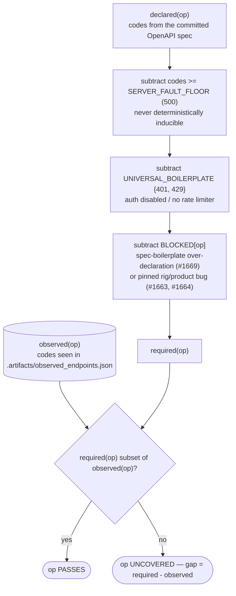
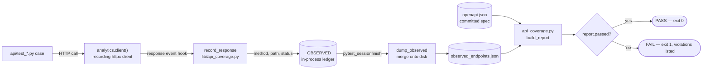
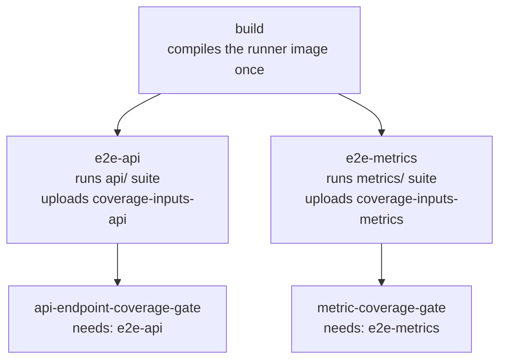

# Feature: API Endpoint Contract Suite & Per-Status-Code Coverage Gate

- [ ] `p1` - **ID**: `cpt-bronze-to-api-e2e-featstatus-api-coverage-gate`

<!-- toc -->

- [1. Feature Context](#1-feature-context)
  - [1.1 Overview](#11-overview)
  - [1.2 Purpose](#12-purpose)
  - [1.3 Actors](#13-actors)
  - [1.4 References](#14-references)
- [2. Actor Flows (CDSL)](#2-actor-flows-cdsl)
  - [Author a Contract Case and Enforce It via the Gate](#author-a-contract-case-and-enforce-it-via-the-gate)
- [3. Processes / Business Logic (CDSL)](#3-processes--business-logic-cdsl)
  - [Match Observed Requests to Spec Operations](#match-observed-requests-to-spec-operations)
  - [Build the Coverage Report (Per-Status-Code Verdict)](#build-the-coverage-report-per-status-code-verdict)
  - [Record and Merge the Observed Ledger](#record-and-merge-the-observed-ledger)
- [4. States (CDSL)](#4-states-cdsl)
  - [Per-Operation Coverage Verdict](#per-operation-coverage-verdict)
- [5. Definitions of Done](#5-definitions-of-done)
  - [Recording Chokepoint](#recording-chokepoint)
  - [Per-Status-Code Verdict](#per-status-code-verdict)
  - [SKIP_LIST / BLOCKED Hygiene](#skip_list--blocked-hygiene)
  - [Total Contract Coverage](#total-contract-coverage)
  - [Pinned Bugs, Not Fixes](#pinned-bugs-not-fixes)
  - [Independent CI Lanes, Isolated Gates](#independent-ci-lanes-isolated-gates)
- [6. Acceptance Criteria](#6-acceptance-criteria)
- [Additional Context (optional)](#additional-context-optional)

<!-- /toc -->

## 1. Feature Context

- [ ] `p2` - `cpt-bronze-to-api-e2e-feature-api-coverage-gate`

### 1.1 Overview

Every documented analytics HTTP operation now gets a per-case contract test under `api/`, and a second, independent mechanism proves it in CI: an httpx response hook records every `(method, path) -> status` the suite actually exercises, and a pure-Python script diffs that ledger against the committed OpenAPI spec (`docs/components/backend/analytics/openapi.json`, 20 operations). Unlike a route-reachability check, the verdict is **per status code** — an operation passes only when the suite observed *every one* of its `required` codes, where `required(op) = declared(op) - {codes >= 500} - UNIVERSAL_BOILERPLATE{401,429} - BLOCKED[op]`. Server-fault codes (>= 500) are declared for spec fidelity but never required. `UNIVERSAL_BOILERPLATE` drops 401/429 on every route (auth is disabled, nothing rate-limits). `BLOCKED` is a per-operation set of declared codes a black-box rig provably cannot observe — mostly the committed spec's `.standard_errors` boilerplate over-declaring codes a route cannot answer (a spec-fidelity bug, filed as #1669), plus two pinned product bugs (#1663, #1664). `SKIP_LIST` (empty) and `BLOCKED` are both self-cleaning: an entry that drifts out of sync with reality (the code became observed, or the operation/code dropped out of the spec) fails the gate until removed, so the baseline can never quietly go stale.

This feature is **test-only**: it ships zero changes to `src/backend`. The committed OpenAPI spec and `src/backend/services/analytics/src/api/mod.rs` are unchanged on this branch — the spec remains the uniform `.standard_errors` boilerplate that stamps `{400,401,403,404,409,429,500}` on every one of the 20 operations regardless of what its handler can produce. Rather than hand-correcting the spec or the handlers, the gate absorbs the over-declaration via `BLOCKED` and files the correction as a bug (#1669) for the backend devs; the two genuine product bugs it also pins (#1663, #1664) are filed separately, and are likewise not fixed here.

The following diagram derives `required(op)` from the declared codes for one operation, and shows the pass/fail branch:

### 1.2 Purpose

An earlier iteration of this ledger-and-diff mechanism was observability-only: with a read-only metric suite touching few routes, a pass/fail gate would have been almost entirely skip-listed, so the report just printed alongside the (blocking) metric-coverage gate. This feature closes that gap from the other direction — it adds the `api/` contract suite that exercises **every** documented operation (one test per `(path, method, status-code)` case, self-cleaning fixtures so scratch resources never leak into list/catalog reads), which lets `SKIP_LIST` go empty and promotes the report to a blocking `api-endpoint-coverage-gate` CI job, mirroring the already-blocking `metric-coverage-gate` for the `metrics/` suite. A backend developer who adds an operation to the analytics OpenAPI surface without a matching contract test now fails a required CI check instead of merging silently uncovered.

**Requirements**: `cpt-bronze-to-api-e2e-fr-coverage-gate`, `cpt-bronze-to-api-e2e-fr-api-roundtrip`, `cpt-bronze-to-api-e2e-nfr-per-test-latency`

**Principles**: `cpt-bronze-to-api-e2e-principle-shared-session`, `cpt-bronze-to-api-e2e-principle-fixtures-are-truth`

**Constraints**: `cpt-bronze-to-api-e2e-constraint-loopback-only`

### 1.3 Actors

| Actor | Role in Feature |
|-------|-----------------|
| `cpt-bronze-to-api-e2e-actor-test-author` | Writes/edits `api/test_*.py` contract cases against self-cleaning fixtures; runs the suite and the gate locally before pushing |
| `cpt-bronze-to-api-e2e-actor-backend-developer` | Changes analytics endpoints or the committed OpenAPI spec; the gate blocks a PR that adds an operation without a matching contract test |
| `cpt-bronze-to-api-e2e-actor-ci-pipeline` | Runs the `e2e-api` lane and the `api-endpoint-coverage-gate` job on every PR; the job is a required branch-protection check |
| `cpt-bronze-to-api-e2e-actor-analytics-api` | Service under test; every request the suite sends passes through its one recording client, the sole observation chokepoint |

### 1.4 References

- **PRD**: [../PRD.md](../PRD.md)
- **DESIGN**: [../DESIGN.md](../DESIGN.md)
- **DECOMPOSITION**: [../DECOMPOSITION.md](../DECOMPOSITION.md)
- **Related features**: `cpt-bronze-to-api-e2e-feature-yaml-rig` (the `metrics/` suite whose own gate, `metric-coverage-gate`, this feature's `api-endpoint-coverage-gate` mirrors as an independent CI lane); `cpt-bronze-to-api-e2e-feature-csv-rig` (established the `session-rig`/`api-client` this feature's suite reuses)
- **Depends on**: `cpt-bronze-to-api-e2e-feature-csv-rig`
- **External**: the coverage universe is the committed OpenAPI spec `docs/components/backend/analytics/openapi.json`, kept accurate by the Analytics API Design's OpenAPI drift gate — see [Analytics API Design](../../../../components/backend/analytics/DESIGN.md)

## 2. Actor Flows (CDSL)

### Author a Contract Case and Enforce It via the Gate

- [ ] `p1` - **ID**: `cpt-bronze-to-api-e2e-flow-api-coverage-author-and-gate`

**Actors**:
- `cpt-bronze-to-api-e2e-actor-test-author`
- `cpt-bronze-to-api-e2e-actor-backend-developer`
- `cpt-bronze-to-api-e2e-actor-ci-pipeline`
- `cpt-bronze-to-api-e2e-actor-analytics-api`

**Success Scenarios**:
- Author adds a `(path, method, status)` case to the matching `api/test_<group>.py` module using a self-cleaning fixture from `api/conftest.py`; the case exercises a previously-uncovered status and the gate stays PASS with 0 missing
- Backend developer ships an analytics change that doesn't touch the OpenAPI surface; the suite and both gates pass unchanged

**Error Scenarios**:
- Backend developer adds a new operation to the committed OpenAPI spec without a matching contract test — `api-endpoint-coverage-gate` fails in CI, naming the operation MISSING
- An operation is exercised, but not every one of its `required` codes is observed (e.g. only its error paths, never its declared 2xx) — the gate fails it as UNCOVERED, listing the missing codes, distinct from MISSING
- A `SKIP_LIST`/`BLOCKED` entry drifts out of sync with reality (an excluded code becomes observed, or the operation/code drops out of the spec) — the gate fails the corresponding hygiene check (REDUNDANT SKIP / STALE SKIP / BLOCKED-NOW-OBSERVED / STALE BLOCKED)

**Steps**:

1. [ ] - `p1` - Author writes/edits a case in the matching `api/test_<group>.py` module (one test per `(path, method, status)`), driving the request through the shared `api` fixture — the same recording httpx client `AnalyticsProcess.client()` returns - `inst-acg-flow-author-case`
2. [ ] - `p1` - Algorithm: every response the client receives is recorded by `cpt-bronze-to-api-e2e-algo-api-coverage-record-and-merge` - `inst-acg-flow-invoke-record`
3. [ ] - `p1` - Test-author runs `./e2e.sh test api/` locally, or the CI `E2E suite — api` job runs the same command - `inst-acg-flow-run-suite`
4. [ ] - `p1` - **AT** session end, Algorithm `cpt-bronze-to-api-e2e-algo-api-coverage-record-and-merge` writes/merges `.artifacts/observed_endpoints.json` - `inst-acg-flow-dump-ledger`
5. [ ] - `p1` - Test-author runs `./e2e.sh gates api` locally; CI's `api-endpoint-coverage-gate` job downloads the `coverage-inputs-api` artifact and invokes the same script against `docs/components/backend/analytics/openapi.json` - `inst-acg-flow-run-gate`
6. [ ] - `p1` - Algorithm: the gate builds the verdict via `cpt-bronze-to-api-e2e-algo-api-coverage-build-report` - `inst-acg-flow-invoke-report`
7. [ ] - `p1` - **IF** `report.passed` **RETURN** the markdown table with a PASS banner; exit 0 - `inst-acg-flow-return-pass`
8. [ ] - `p1` - **ELSE** **RETURN** the markdown table plus an itemized violations section (one line per MISSING / UNCOVERED / REDUNDANT SKIP / STALE SKIP / BLOCKED-NOW-OBSERVED / STALE BLOCKED finding); exit 1 — the required CI check goes red, naming the exact operation(s) and code(s) to fix - `inst-acg-flow-return-fail`

## 3. Processes / Business Logic (CDSL)

### Match Observed Requests to Spec Operations

- [ ] `p1` - **ID**: `cpt-bronze-to-api-e2e-algo-api-coverage-match-observed`

**Input**: `observed` (ledger rows: `{method, path, statuses[]}`), `spec_ops` (map `"METHOD path"` → declared HTTP status codes, from the committed OpenAPI spec)

**Output**: `validated` (map `"METHOD path"` → union of observed status codes, for matched operations), `unmatched` (observed rows with no matching spec operation)

**Steps**:

1. [ ] - `p1` - Group `spec_ops` keys by HTTP method; split each path into `/`-separated segments - `inst-acg-match-group-by-method`
2. [ ] - `p1` - **FOR EACH** method's group of path templates, sort ascending by count of `{param}` segments — a literal-only path wins over a same-arity template regardless of the spec's declaration order - `inst-acg-match-sort-templates`
3. [ ] - `p1` - **FOR EACH** observed row `(method, path, statuses)` - `inst-acg-match-foreach-row`
   1. [ ] - `p1` - Split `path` into segments - `inst-acg-match-split-path`
   2. [ ] - `p1` - **FOR EACH** candidate template of the matching method, in sorted order - `inst-acg-match-foreach-template`
      1. [ ] - `p1` - **IF** segment counts differ, skip this template - `inst-acg-match-arity-skip`
      2. [ ] - `p1` - **IF** every segment is either a `{param}` placeholder or equals the observed segment literally, **RETURN** this template as the match and stop scanning - `inst-acg-match-segment-match`
   3. [ ] - `p1` - **IF** no template matched, append the row to `unmatched` - `inst-acg-match-append-unmatched`
   4. [ ] - `p1` - **ELSE** union the row's `statuses` into `validated[matched_op]` - `inst-acg-match-union-statuses`
4. [ ] - `p1` - **RETURN** `(validated, unmatched)` - `inst-acg-match-return`

### Build the Coverage Report (Per-Status-Code Verdict)

- [ ] `p1` - **ID**: `cpt-bronze-to-api-e2e-algo-api-coverage-build-report`

**Input**: `spec` (parsed OpenAPI document), `observed` (ledger rows)

**Output**: a `CoverageReport` — `covered`, `skipped`, `missing`, `redundant_skips`, `stale_skips`, `required` (per-op required-code set), `uncovered` (per-op gap of required codes never observed), `blocked_observed` (excluded codes actually observed), `stale_blocked`, and a derived `passed: bool`

**Steps**:

1. [ ] - `p1` - Derive `spec_ops`: every operation across all declared paths/methods, `"METHOD path"` → its declared HTTP status codes - `inst-acg-report-derive-spec-ops`
2. [ ] - `p1` - Algorithm: match `observed` against `spec_ops` via `cpt-bronze-to-api-e2e-algo-api-coverage-match-observed` → `validated`, `unmatched` - `inst-acg-report-invoke-match`
3. [ ] - `p1` - `covered` = spec ops present in `validated`; `missing` = spec ops absent from both `validated` and `SKIP_LIST`; `skipped` = spec ops absent from `validated` but present in `SKIP_LIST` - `inst-acg-report-classify-ops`
4. [ ] - `p1` - `redundant_skips` = `SKIP_LIST` entries whose op IS in `validated` (claimed unreachable, but actually exercised) - `inst-acg-report-redundant-skips`
5. [ ] - `p1` - `stale_skips` = `SKIP_LIST` entries whose op is no longer among `spec_ops` - `inst-acg-report-stale-skips`
6. [ ] - `p1` - **FOR EACH** spec op, compute `required(op)` = the op's declared codes, minus every code `>= SERVER_FAULT_FLOOR (500)`, minus `UNIVERSAL_BOILERPLATE {401, 429}`, minus `BLOCKED[op]` - `inst-acg-report-required-set`
7. [ ] - `p1` - **FOR EACH** `covered` operation, `gap` = `required(op) - validated[op]`; **IF** `gap` is non-empty, record `uncovered[op] = gap` - `inst-acg-report-uncovered`
8. [ ] - `p1` - **FOR EACH** `op, codes` in `BLOCKED` - `inst-acg-report-foreach-blocked`
   1. [ ] - `p1` - **IF** `op` is no longer in `spec_ops`, append it to `stale_blocked` ("operation gone from the spec") - `inst-acg-report-stale-blocked-op`
   2. [ ] - `p1` - **ELSE IF** any code in `codes` is no longer among the op's declared codes, append the entry to `stale_blocked` ("codes no longer declared") - `inst-acg-report-stale-blocked-codes`
9. [ ] - `p1` - **FOR EACH** spec op, `excluded` = `UNIVERSAL_BOILERPLATE` union `BLOCKED[op]`; **IF** `excluded` intersects `validated[op]`, record `blocked_observed[op]` = that intersection — an exclusion the suite now actually observes - `inst-acg-report-blocked-observed`
10. [ ] - `p1` - `passed` = **TRUE** **UNLESS** any of `{missing, uncovered, redundant_skips, stale_skips, blocked_observed, stale_blocked}` is non-empty - `inst-acg-report-passed`
11. [ ] - `p1` - **RETURN** the `CoverageReport` - `inst-acg-report-return`

### Record and Merge the Observed Ledger

- [ ] `p1` - **ID**: `cpt-bronze-to-api-e2e-algo-api-coverage-record-and-merge`

**Input**: the shared recording httpx client's response stream; an on-disk ledger path (`.artifacts/observed_endpoints.json`)

**Output**: void (side effect: the on-disk ledger reflects every request observed this session, merged with any prior content)

**Steps**:

1. [ ] - `p1` - Attach `record_response` as a `response` event hook on the single httpx client `AnalyticsProcess.client()` constructs — every request any `api/` or `metrics/` test issues flows through this one chokepoint - `inst-acg-record-attach-hook`
2. [ ] - `p1` - **FOR EACH** response received, read only `(request.method, request.url.path, response.status_code)` off the already-received response — never the body — and add the status into the in-process ledger `_OBSERVED[(method, path)]` - `inst-acg-record-log-status`
3. [ ] - `p1` - **AT** `pytest_sessionfinish`, on the primary worker only - `inst-acg-record-sessionfinish`
   1. [ ] - `p1` - **IF** an `observed_endpoints.json` file already exists on disk, load it and seed a `merged` map from its rows - `inst-acg-record-load-existing`
   2. [ ] - `p1` - **FOR EACH** `(method, path)` in `_OBSERVED`, union its statuses into `merged` - `inst-acg-record-union-merge`
   3. [ ] - `p1` - Write `merged`, sorted by `(method, path)`, back to `observed_endpoints.json` - `inst-acg-record-write`
4. [ ] - `p1` - **RETURN** void - `inst-acg-record-return`

**CI Lane Topology** — the merge in step 3 exists for **local** development, where `./e2e.sh test api/` followed by `./e2e.sh test metrics/` share one `.artifacts/` directory and a plain overwrite would drop whichever suite ran first. In CI, `build` compiles the runner image once and hands it to two independent lanes that each run a single, fresh pytest session — so there is no cross-session ledger to merge there; each lane uploads its own artifact, and each gate job downloads only its own lane's artifact.

A red `build` SKIPS (not fails) both `e2e-api` and `e2e-metrics`; a skipped lane in turn skips its gate (`needs.<lane>.result != 'skipped'` guard on each gate job) — but GitHub still reports a skipped required check as failed/pending, so branch protection blocks regardless.

## 4. States (CDSL)

### Per-Operation Coverage Verdict

- [ ] `p1` - **ID**: `cpt-bronze-to-api-e2e-state-api-coverage-verdict`

**States**: `UNSEEN`, `EXERCISED`, `COVERED`, `UNCOVERED`, `SKIPPED`, `MISSING`

**Initial State**: `UNSEEN`

**Transitions**:

1. [ ] - `p1` - **FROM** `UNSEEN` **TO** `EXERCISED` **WHEN** the merged ledger records at least one observed status for this operation - `inst-acg-state-unseen-exercised`
2. [ ] - `p1` - **FROM** `UNSEEN` **TO** `SKIPPED` **WHEN** the ledger never records the operation **AND** it carries a `SKIP_LIST` entry - `inst-acg-state-unseen-skipped`
3. [ ] - `p1` - **FROM** `UNSEEN` **TO** `MISSING` **WHEN** the ledger never records the operation **AND** it carries no `SKIP_LIST` entry - `inst-acg-state-unseen-missing`
4. [ ] - `p1` - **FROM** `EXERCISED` **TO** `COVERED` **WHEN** `required(op)` (declared codes, minus `>= 500`, minus `UNIVERSAL_BOILERPLATE`, minus `BLOCKED[op]`) is a subset of the observed statuses — this holds trivially, with an empty `required(op)`, for an op all of whose declared codes are 5xx/boilerplate/BLOCKED - `inst-acg-state-exercised-covered`
5. [ ] - `p1` - **FROM** `EXERCISED` **TO** `UNCOVERED` **WHEN** `required(op) - observed` is non-empty — at least one required code was never seen - `inst-acg-state-exercised-uncovered`
6. [ ] - `p1` - **FROM** `COVERED` **TO** gate-level FAIL **WHEN** a code in `UNIVERSAL_BOILERPLATE` or `BLOCKED[op]` is now also observed (the exclusion no longer holds — the limitation/bug is resolved or the spec corrected) **OR** a `BLOCKED[op]` entry is no longer among the op's declared codes (or the op itself is gone from the spec) - `inst-acg-state-covered-hygiene-fail`
7. [ ] - `p1` - **FROM** `SKIPPED` **TO** gate-level FAIL **WHEN** the operation is no longer among the spec's operations (stale skip) **OR** is now present in `validated` (redundant skip) - `inst-acg-state-skipped-hygiene-fail`

## 5. Definitions of Done

### Recording Chokepoint

- [ ] `p1` - **ID**: `cpt-bronze-to-api-e2e-dod-api-coverage-recording`

The system **MUST** attach `lib.api_coverage.record_response` as an httpx `response` event hook on the single client `AnalyticsProcess.client()` returns, so every request any `api/` or `metrics/` test issues is logged as `(method, path) -> {status codes}` without reading the response body. `conftest.pytest_sessionfinish` **MUST** dump the ledger (primary xdist worker only) to `.artifacts/observed_endpoints.json`, **MERGING** with any existing file's `(method, path)` entries (union of statuses) rather than overwriting, so two suite sessions sharing one `.artifacts/` directory don't lose one session's coverage; a missing prior file is treated as an empty ledger.

**Implements**:
- `cpt-bronze-to-api-e2e-flow-api-coverage-author-and-gate`
- `cpt-bronze-to-api-e2e-algo-api-coverage-record-and-merge`

**Touches**: `src/ingestion/tests/e2e/lib/api_coverage.py` (`record_response`, `dump_observed`), `src/ingestion/tests/e2e/conftest.py` (`pytest_sessionfinish`), `src/ingestion/tests/e2e/lib/analytics.py` (`AnalyticsProcess.client` event-hook wiring)

### Per-Status-Code Verdict

- [ ] `p1` - **ID**: `cpt-bronze-to-api-e2e-dod-api-coverage-status-aware-verdict`

The gate **MUST** compute, for every documented operation, `required(op) = declared(op) - {codes >= SERVER_FAULT_FLOOR (500)} - UNIVERSAL_BOILERPLATE {401, 429} - BLOCKED[op]`, and **MUST** mark the operation covered only when `required(op)` is a subset of the ledger's observed codes for that operation. `SERVER_FAULT_FLOOR` excludes server-fault 5xx everywhere (not deterministically inducible by a black-box contract test); `UNIVERSAL_BOILERPLATE` excludes 401/429 on every route (gateway auth disabled, no rate limiter); `BLOCKED` excludes a per-operation set of declared codes the rig provably cannot observe. An operation with a non-empty gap (`required(op) - observed`) **MUST** fail as UNCOVERED, listing the missing codes, distinguishable in the report from MISSING (never exercised at all). `required(op)` may be the empty set (an op all of whose declared codes are 5xx/boilerplate/BLOCKED), in which case the operation passes once merely exercised.

**Implements**:
- `cpt-bronze-to-api-e2e-algo-api-coverage-build-report`
- `cpt-bronze-to-api-e2e-state-api-coverage-verdict`

**Touches**: `src/ingestion/tests/e2e/lib/api_coverage.py` (`CoverageReport.__post_init__`, `CoverageReport.required_codes`, `SERVER_FAULT_FLOOR`, `UNIVERSAL_BOILERPLATE`, `BLOCKED`)

### SKIP_LIST / BLOCKED Hygiene

- [ ] `p1` - **ID**: `cpt-bronze-to-api-e2e-dod-api-coverage-hygiene`

The gate **MUST** fail when: (a) a `SKIP_LIST` entry's operation is actually exercised (redundant skip); (b) a `SKIP_LIST` entry's operation is no longer present in the committed spec (stale skip); (c) a `BLOCKED[op]` entry's operation is no longer in the spec, or one of its codes is no longer declared for that operation (stale blocked); (d) a code excluded by `UNIVERSAL_BOILERPLATE` or `BLOCKED[op]` is now actually observed for that operation (blocked-now-observed — the limitation/bug is resolved, or the spec's over-declaration was corrected, so the exclusion must be dropped). Each of these forces the corresponding scaffolding entry out of the gate's source the moment reality catches up with it — there is no code path that lets a stale or redundant exclusion linger silently.

**Implements**:
- `cpt-bronze-to-api-e2e-algo-api-coverage-build-report`
- `cpt-bronze-to-api-e2e-state-api-coverage-verdict`

**Touches**: `src/ingestion/tests/e2e/lib/api_coverage.py` (`redundant_skips`, `stale_skips`, `blocked_observed`, `stale_blocked`)

### Total Contract Coverage

- [ ] `p1` - **ID**: `cpt-bronze-to-api-e2e-dod-api-coverage-total-suite`

The system **MUST** ship a per-case contract suite under `api/` — one module per path group (`test_metrics.py`, `test_metric_thresholds.py`, `test_admin_thresholds.py`, `test_catalog.py`, `test_columns.py`, `test_persons.py`) — with one test per `(path, method, status-code)` case, using self-cleaning function-scoped fixtures (`api/conftest.py`) so scratch resources never leak into list/catalog reads, exercising all 20 spec operations. `SKIP_LIST` **MUST** be empty as a result: a new spec operation shipped without a matching contract test **MUST** fail the gate as MISSING. As shipped, `./e2e.sh test api/` reports 58 passed / 12 xfailed (strict) and `./e2e.sh gates api` reports PASS: 20/20 operations exercised, 0 with uncovered codes, 0 missing.

**Implements**:
- `cpt-bronze-to-api-e2e-flow-api-coverage-author-and-gate`

**Touches**: `src/ingestion/tests/e2e/api/{conftest.py,endpoint_helpers.py,test_metrics.py,test_metric_thresholds.py,test_admin_thresholds.py,test_catalog.py,test_columns.py,test_persons.py}`; `src/ingestion/tests/e2e/lib/api_coverage.py` (`SKIP_LIST = []`)

### Pinned Bugs, Not Fixes

- [ ] `p1` - **ID**: `cpt-bronze-to-api-e2e-dod-api-coverage-pinned-xfails`

This feature is **test-only**: it ships zero changes to `src/backend`. The committed OpenAPI spec (`docs/components/backend/analytics/openapi.json`) and `src/backend/services/analytics/src/api/mod.rs` are unchanged on this branch — both remain exactly what they were before this feature's work started. Where the black-box rig proves the spec or a handler wrong, the suite pins the gap as a `strict=True` xfail (or, for a spec-fidelity gap the suite cannot even attempt to satisfy, a `BLOCKED[op]` entry) and the finding is filed as a bug for the backend devs, rather than corrected in this PR:

- **#1663** — every read of a non-empty per-metric `thresholds` table 500s (`thresholds.value` is `DECIMAL(20,6)`, read into an `f64` entity). The `scratch_threshold` fixture (`api/conftest.py`) calls `pytest.xfail(...)` the moment its setup create 500s, so every legacy-threshold success-path case that depends on it xfails; its success codes `{200, 201, 204}` are excluded per-operation via `BLOCKED`.
- **#1664** — a duplicate admin-threshold create (`POST /v1/admin/metric-thresholds`) answers 500 (an unmapped UNIQUE-constraint violation) instead of the declared 409; `test_create_409_duplicate` (`api/test_admin_thresholds.py`) pins the contract as a strict xfail, and `409` is excluded via `BLOCKED["POST /v1/admin/metric-thresholds"]`.
- **#1669** (filed this session) — **spec fidelity**: the committed spec is generated from `.standard_errors(openapi)` in `analytics/src/api/mod.rs`, which stamps a uniform `{400, 401, 403, 404, 409, 429, 500}` on all 20 operations regardless of what each handler can actually produce — over-declaring codes routes cannot answer (most of the `BLOCKED` table below), and under-declaring real ones the handlers do emit (415, 422, 503, and route-specific 403/409). The fix is a per-route `.problem_response` registration in `mod.rs` plus a regenerated committed spec — a product change intentionally out of scope for this test-only PR.
- **#1670** (filed this session, formerly "Bug A") — the six legacy `axum::Json`-bodied endpoints (POST/PUT metrics, POST metric query, POST batch queries, POST/PUT per-metric thresholds) answer a bad request body with a non-canonical plain-text 415/400/**422** instead of a canonical 400 via the existing `api/canonical_json.rs` extractor. Pinned by the `test_*_400_schema_mismatch` cases (`strict=True` xfail: they assert 400, observe 422 today, and will XPASS the moment #1670 unifies the body extractor). Also covers the sibling gap (non-canonical plain-text 400 on a malformed `Path<Uuid>`).

Each xfail's matching `BLOCKED` entry **MUST** exclude only the pinned code(s). When a bug is fixed, the strict xfail **MUST** XPASS (failing pytest) and the newly-observed code **MUST** trip the blocked-now-observed hygiene (`cpt-bronze-to-api-e2e-dod-api-coverage-hygiene`), forcing removal of both the xfail and its `BLOCKED` entry in the same change.

`GET /v1/persons/{email}` resolves a person via the identity service. PRD §4.2 keeps the **real** identity service out of v1 scope, so the rig wires an in-process identity stub (`lib/identity_stub.py`) rather than standing up the service: it returns a canned `Person` for one seeded email and 404 for every other email. `test_person_lookup_200_found` and `test_person_lookup_404_unknown` (`api/test_persons.py`) exercise both documented outcomes — 200 (a seeded email resolves) and 404 (unknown email) — so `BLOCKED["GET /v1/persons/{email}"] = {400, 403, 409}` now excludes only the `.standard_errors` boilerplate (#1669) and the op's `required` set `{200, 404}` is fully covered. The stub answers purely by email: the analytics identity client sends no caller header (in production the api-gateway injects it), so the real service would 401 the header-less call — the stub is what covers both branches while keeping this a test-only change. This is how the total-coverage DoD (`cpt-bronze-to-api-e2e-dod-api-coverage-total-suite`) counts every committed operation without standing up the real identity service.

**Implements**:
- `cpt-bronze-to-api-e2e-flow-api-coverage-author-and-gate`

**Touches**: `src/ingestion/tests/e2e/api/conftest.py` (`scratch_threshold` fixture), `src/ingestion/tests/e2e/api/test_metric_thresholds.py` (`test_*_400_schema_mismatch` xfails), `src/ingestion/tests/e2e/api/test_admin_thresholds.py::test_create_409_duplicate`, `src/ingestion/tests/e2e/api/test_metrics.py` (`test_*_400_schema_mismatch` xfails); `src/ingestion/tests/e2e/lib/api_coverage.py` (`BLOCKED` entries for the legacy-threshold operations, `POST /v1/admin/metric-thresholds`, and `GET /v1/persons/{email}`)

### Independent CI Lanes, Isolated Gates

- [ ] `p1` - **ID**: `cpt-bronze-to-api-e2e-dod-api-coverage-ci-lanes`

CI **MUST** build the runner image once (`build` job) and hand it to two independent lanes — `e2e-api` (runs `api/`, uploads `coverage-inputs-api`) and `e2e-metrics` (runs `metrics/`, uploads `coverage-inputs-metrics`) — that share nothing at runtime. `api-endpoint-coverage-gate` **MUST** run after `e2e-api`, download only `coverage-inputs-api`, and **MUST** be skipped (not failed) when `e2e-api` itself was skipped (a red `build`); `metric-coverage-gate` **MUST** mirror this against `e2e-metrics`. `meta/` **MUST NOT** run in CI.

**Implements**:
- `cpt-bronze-to-api-e2e-algo-api-coverage-record-and-merge`

**Touches**: `.github/workflows/e2e-bronze-to-api.yml` (`build`, `e2e-api`, `e2e-metrics`, `api-endpoint-coverage-gate`, `metric-coverage-gate` jobs)

## 6. Acceptance Criteria

- [ ] **Given** a clean checkout, **When** `./e2e.sh test api/` then `./e2e.sh gates api` run, **Then** the suite reports 58 passed / 12 xfailed (strict) and the endpoint gate reports PASS: 20/20 operations exercised, 0 with uncovered codes, 0 missing
- [ ] **Given** a PR adds an operation to `docs/components/backend/analytics/openapi.json` without a matching `api/` contract test, **When** `api-endpoint-coverage-gate` runs in CI, **Then** it fails naming the operation MISSING
- [ ] **Given** an operation's suite never observes one of its `required(op)` codes (declared, minus `>= 500`, minus `UNIVERSAL_BOILERPLATE`, minus `BLOCKED[op]`), **When** the gate runs, **Then** it fails that operation as UNCOVERED, listing the missing code(s), distinct from MISSING
- [ ] **Given** #1663, #1664, #1669, or #1670 is fixed upstream and its `BLOCKED` entry is left in place, **When** the suite and gate run, **Then** the strict xfail XPASSes (failing pytest) and the gate fails as blocked-now-observed, together forcing removal of the scaffolding
- [ ] **Given** the `e2e-api` and `e2e-metrics` lanes both run, **When** either gate job runs, **Then** it consumes only its own lane's uploaded artifact, and a red suite in one lane never fails the other lane's job
- [ ] **Given** the `build` job fails, **When** `e2e-api`/`e2e-metrics` are skipped as a result, **Then** `api-endpoint-coverage-gate`/`metric-coverage-gate` are skipped too (not red), and the required checks still block merge
- [ ] **Given** this feature's own PR diff, **When** `src/backend` is inspected, **Then** it contains zero changes — the committed OpenAPI spec and `analytics/src/api/mod.rs` are unchanged, and every spec/handler gap the gate surfaces is filed as a bug (#1663, #1664, #1669, #1670) rather than fixed in place

## Additional Context (optional)

**Not applicable**: Authentication/Authorization (SEC) — the rig disables auth entirely (`cpt-bronze-to-api-e2e-constraint-loopback-only`); this feature only observes traffic on an already-loopback-only client and introduces no new attack surface or credentials. Performance/Scalability (PERF) — the gate is a pure-Python, stdlib-only diff of two small JSON documents that completes in a fraction of a second; it carries none of the per-test latency budget in `cpt-bronze-to-api-e2e-nfr-per-test-latency`. Usability/Accessibility (UX) — there is no UI; the audience is developers reading a markdown table in a terminal or a CI job summary. Data Privacy/Regulatory Compliance (COMPL) — the ledger records only HTTP method/path/status metadata, never request or response bodies, and touches no PII.

**Partially applicable**: Observability (OPS) — the gate's markdown report is written to the CI job's step summary and to stdout locally, and `conftest.pytest_sessionfinish` logs the ledger's operation count through the rig's standard logging channel. There is no dedicated tracing/metrics integration beyond this: the gate is a short-lived, single-invocation script, not a long-running service.

**Rollout & Rollback (OPS)**: Enabling this feature flips a report-only job into a required branch-protection check — an admin action tracked **outside the repo**. Enablement: the branch-protection ruleset must swap the old single required check for the split lane and gate checks — `E2E suite — api`, `E2E suite — metrics`, `API endpoint coverage gate`, and `Metric coverage gate` — which must match the job `name:` values verbatim (see the NB comment in the jobs section of `.github/workflows/e2e-bronze-to-api.yml`; the old single `Run E2E suite` check no longer exists). Rollback: temporarily mark `API endpoint coverage gate` non-required in branch protection, or — for a specific false failure — land a scoped `BLOCKED` / `SKIP_LIST` correction (whose self-cleaning hygiene, per `cpt-bronze-to-api-e2e-dod-api-coverage-hygiene`, forces its later removal once reality catches up). No data-migration or backward-compatibility concerns: the gate is a stateless, single-invocation CI check that persists nothing.
